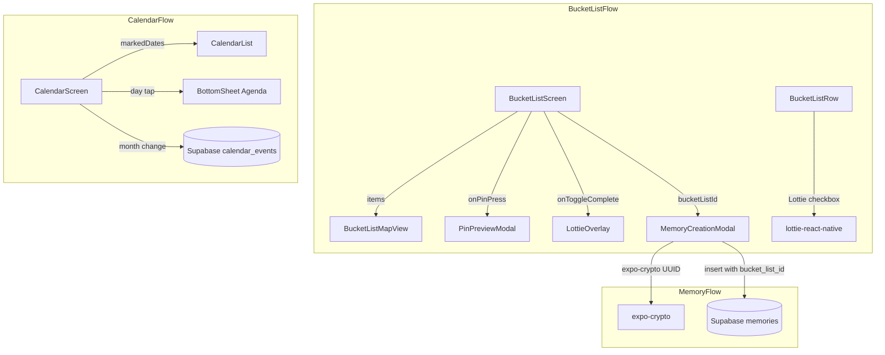

# Design Document: Enterprise UX Upgrade

## Overview

This design covers eight improvements to the WeDo React Native Expo app spanning reliability fixes, calendar enhancements, bucket list animations, and map view polish. The changes touch four primary screens/components: `MemoryCreationModal`, `CalendarScreen`, `BucketListScreen`, and `BucketListMapView`.

Key changes:
1. Replace `crypto.randomUUID()` with `expo-crypto` to fix crashes on native devices
2. Thread `bucket_list_id` through the memory creation flow to link memories to bucket list items
3. Fetch calendar events at the month level instead of per-date
4. Add Soft Coral dot indicators on calendar days that have events
5. Replace the current events section with a `@gorhom/bottom-sheet` agenda view
6. Replace static emoji checkboxes with Lottie animations in bucket list rows
7. Restyle map markers from Soft Coral to Teal Accent
8. Ensure pin preview card works with the existing `PinPreviewModal`

### New Dependencies

| Package | Version | Purpose |
|---------|---------|---------|
| `expo-crypto` | ~14.0.x (Expo 54 compatible) | Cross-platform `randomUUID()` |
| `@gorhom/bottom-sheet` | ^5.x | Calendar agenda bottom sheet |

Both require `npx expo install` to ensure SDK compatibility. `@gorhom/bottom-sheet` depends on `react-native-reanimated` and `react-native-gesture-handler`, both already installed.

## Architecture



### Data Flow Changes

1. **UUID Generation**: `MemoryCreationModal.handleSubmit` → `Crypto.randomUUID()` (expo-crypto) instead of `crypto.randomUUID()`
2. **Bucket List → Memory Link**: `BucketListScreen` stores the completing item's ID → passes `bucketListId` prop to `MemoryCreationModal` → included in Supabase insert payload
3. **Month-Level Event Fetch**: `CalendarScreen.onMonthChange` / `onVisibleMonthsChange` → fetches all events for the month range → groups by day → feeds `markedDates` prop and bottom sheet
4. **Bottom Sheet Agenda**: Day tap → opens `@gorhom/bottom-sheet` with filtered events for that day (replaces `DayNoteModal` for event display)
5. **Lottie Checkbox**: `BucketListRow` renders `LottieView` instead of emoji text → `progress` shared value controls frame (0 = unchecked, 1 = checked)
6. **Map Markers**: `BucketListMapView` marker dot color changes from `#FF7F50` to `#40E0D0` with matching shadow

## Components and Interfaces

### 1. MemoryCreationModal (Modified)

**File**: `src/components/MemoryCreationModal.tsx`

**Interface change**:
```typescript
interface MemoryCreationModalProps {
  visible: boolean;
  onClose: () => void;
  bucketListId?: string | null;  // NEW: optional bucket list item ID
}
```

**Key modifications**:
- Import `* as Crypto from 'expo-crypto'` replacing `crypto.randomUUID()`
- Line 97: `const entryId = Crypto.randomUUID();`
- Insert payload adds `bucket_list_id: bucketListId ?? null`

### 2. MemoryEntry Type (Modified)

**File**: `src/services/realtimeManager.ts`

```typescript
export interface MemoryEntry {
  id: string;
  relationship_id: string;
  created_by: string;
  photo_url: string;
  caption: string;
  revealed: boolean;
  audio_url: string | null;
  bucket_list_id: string | null;  // NEW
  created_at: string;
}
```

### 3. CalendarScreen (Modified)

**File**: `src/screens/CalendarScreen.tsx`

**Key modifications**:
- New state: `monthEvents: Map<string, CalendarEvent[]>` — events grouped by day for the visible month
- New function: `fetchEventsForMonth(yearMonth: string)` — single Supabase query with `gte`/`lte` on first/last day
- `onMonthChange` and `onVisibleMonthsChange` trigger `fetchEventsForMonth`
- Build `markedDates` object from `monthEvents` keys, each with `{ marked: true, dotColor: '#FF7F50' }`
- Day tap opens a `BottomSheet` instead of (or in addition to) `DayNoteModal`
- New `BottomSheet` ref and snap points (`['25%', '50%']`)
- Remove the inline `eventsSection` View; events now render inside the bottom sheet

**New imports**:
```typescript
import BottomSheet, { BottomSheetFlatList } from '@gorhom/bottom-sheet';
```

### 4. CalendarScreen renderDay (Modified)

The existing `renderDay` callback already renders a `noteDot`. The event dot will be added alongside it using the `markedDates` approach on `CalendarList` (which renders dots natively) OR by adding a second dot in `renderDay` when the day has events in `monthEvents`.

Since we use a custom `dayComponent`, `markedDates` dots won't render automatically. We'll add the event dot directly in `renderDay`:

```typescript
const hasEvents = monthEvents.has(date.dateString);
// ... inside the day cell JSX:
{hasEvents && <View style={styles.eventDot} />}
```

The `eventDot` style: `{ width: 5, height: 5, borderRadius: 2.5, backgroundColor: '#FF7F50', marginTop: 1 }`

When both `hasNote` and `hasEvents` are true, render them side by side in a row.

### 5. BucketListScreen (Modified)

**File**: `src/screens/BucketListScreen.tsx`

**Key modifications**:
- New state: `completingItemId: string | null` — tracks which item triggered the memory modal
- `handleToggleComplete`: when marking complete, set `completingItemId = item.id` before showing Lottie/modal
- Pass `bucketListId={completingItemId}` to `MemoryCreationModal`
- On modal close, reset `completingItemId` to `null`

### 6. BucketListRow (Modified)

**File**: `src/screens/BucketListScreen.tsx` (inline component)

**Key modifications**:
- Replace `<Text style={styles.checkboxIcon}>{item.completed ? '✅' : '⬜'}</Text>` with a `LottieView`
- Use `progress` prop (Reanimated shared value) to control animation frame:
  - `progress = 0` → unchecked state (first frame)
  - `progress = 1` → checked state (last frame)
- On tap to complete: animate `progress` from 0 → 1 using `withTiming`, then call `onToggleComplete`
- On tap to uncomplete: instantly set `progress` to 0 (no animation)
- When `item.completed` is true on mount, set `progress = 1` immediately (static last frame)

```typescript
import LottieView from 'lottie-react-native';
import { useSharedValue, withTiming } from 'react-native-reanimated';

// Inside BucketListRow:
const progress = useSharedValue(item.completed ? 1 : 0);
```

### 7. BucketListMapView (Modified)

**File**: `src/components/BucketListMapView.tsx`

**Style-only change** — update `markerDot` styles:
```typescript
markerDot: {
  width: 14,
  height: 14,
  borderRadius: 7,
  backgroundColor: '#40E0D0',   // was #FF7F50
  borderWidth: 2,
  borderColor: '#FFFFFF',
  shadowColor: '#40E0D0',       // was #FF7F50
  shadowOffset: { width: 0, height: 0 },
  shadowOpacity: 0.6,
  shadowRadius: 4,
  elevation: 4,
},
```

### 8. PinPreviewModal (No Changes)

The existing `PinPreviewModal` already satisfies Requirement 8. It displays `title`, `place_name`, has a dismiss button, and slides up from the bottom. No modifications needed.


## Data Models

### Modified: `MemoryEntry` (realtimeManager.ts)

```typescript
export interface MemoryEntry {
  id: string;
  relationship_id: string;
  created_by: string;
  photo_url: string;
  caption: string;
  revealed: boolean;
  audio_url: string | null;
  bucket_list_id: string | null;  // NEW — links to bucket_list_items.id
  created_at: string;
}
```

### Existing (unchanged): `CalendarEvent`

```typescript
export interface CalendarEvent {
  id: string;
  relationship_id: string;
  day: string;           // YYYY-MM-DD
  title: string;
  time: string | null;   // HH:MM or null
  created_by: string;
  created_at: string;
}
```

### Existing (unchanged): `BucketListItem`

```typescript
export interface BucketListItem {
  id: string;
  relationship_id: string;
  title: string;
  url: string | null;
  completed: boolean;
  created_by: string;
  created_at: string;
  latitude: number | null;
  longitude: number | null;
  place_name: string | null;
}
```

### New: Month Events Lookup

A local state structure in `CalendarScreen`, not a persisted model:

```typescript
// Map from "YYYY-MM-DD" → CalendarEvent[]
type MonthEventsMap = Map<string, CalendarEvent[]>;
```

Built by grouping the Supabase query result by `event.day`.

### New: Memory Insert Payload

```typescript
// The Supabase .insert() payload in MemoryCreationModal
interface MemoryInsertPayload {
  id: string;
  relationship_id: string;
  created_by: string;
  photo_url: string;
  caption: string;
  revealed: boolean;
  bucket_list_id: string | null;  // NEW — from bucketListId prop
}
```

## Correctness Properties

*A property is a characteristic or behavior that should hold true across all valid executions of a system — essentially, a formal statement about what the system should do. Properties serve as the bridge between human-readable specifications and machine-verifiable correctness guarantees.*

### Property 1: UUID validity

*For any* invocation of the UUID generator used in `MemoryCreationModal`, the returned string shall be a valid UUID v4 matching the pattern `xxxxxxxx-xxxx-4xxx-yxxx-xxxxxxxxxxxx` where `y` is one of `[8, 9, a, b]`.

**Validates: Requirements 1.1**

### Property 2: Bucket list ID payload mapping

*For any* optional `bucketListId` value (string or undefined/null), the memory insert payload's `bucket_list_id` field shall equal the provided `bucketListId` when present, or `null` when absent.

**Validates: Requirements 2.2, 2.3**

### Property 3: Month date range bounds

*For any* valid year and month (1–12), the computed first-day string shall be `YYYY-MM-01` and the computed last-day string shall be the actual last calendar day of that month (accounting for leap years), both in `YYYY-MM-DD` format.

**Validates: Requirements 3.1**

### Property 4: Event grouping preserves all events

*For any* array of `CalendarEvent` objects, grouping them by their `day` field into a `Map<string, CalendarEvent[]>` shall satisfy: (a) every event appears in exactly one group, (b) the group key matches the event's `day`, and (c) the total count across all groups equals the input array length.

**Validates: Requirements 3.2**

### Property 5: Marked dates matches event days

*For any* `MonthEventsMap` (Map from date string to CalendarEvent[]), the set of keys in the generated `markedDates` object shall equal exactly the set of date strings that have one or more events, and each entry shall have `dotColor` equal to `'#FF7F50'`.

**Validates: Requirements 4.1, 4.2, 4.4**

### Property 6: Events chronological sort

*For any* array of `CalendarEvent` objects for a single day, sorting by the `time` field (nulls last) shall produce a sequence where each event's time is less than or equal to the next event's time.

**Validates: Requirements 5.2**

### Property 7: Lottie progress reflects completion state

*For any* `BucketListItem`, the initial Lottie animation progress value shall be `1` if `item.completed` is `true`, and `0` if `item.completed` is `false`.

**Validates: Requirements 6.4, 6.5**

### Property 8: Filter map items correctness

*For any* array of `BucketListItem` objects, `filterMapItems` shall return exactly those items where `completed` is `false` AND both `latitude` and `longitude` are non-null. No other items shall be included, and no qualifying items shall be excluded.

**Validates: Requirements 7.1, 7.4**

### Property 9: Preview card contains item info

*For any* `BucketListItem` with a non-null `place_name`, the `PinPreviewModal` render output shall contain both the item's `title` and `place_name`. For items with a null `place_name`, only the `title` shall be present.

**Validates: Requirements 8.3**

## Error Handling

### UUID Generation Failure (Req 1.3)
- Wrap `Crypto.randomUUID()` in a try/catch inside `handleSubmit`
- On error: set `error` state to a user-facing message (e.g., `t('memoryCreation.uploadFailed')`)
- Do not proceed with upload — return early after setting error
- The existing `finally { setSubmitting(false) }` block handles resetting the loading state

### Memory Insert Failure (Req 2.2)
- Existing error handling in `handleSubmit` already catches insert errors and shows `uploadFailed`
- Adding `bucket_list_id` to the payload doesn't change the error path
- If the `bucket_list_id` references a non-existent item, Supabase will reject the insert (FK constraint) — caught by the existing `try/catch`

### Month Event Fetch Failure (Req 3.1)
- If the Supabase query for month events fails, keep the existing `monthEvents` map unchanged (stale data is better than no data)
- Log the error for debugging but don't show a user-facing alert for background fetches

### Bottom Sheet Edge Cases (Req 5)
- If `@gorhom/bottom-sheet` fails to render (e.g., missing gesture handler), the calendar still functions — the sheet is additive
- Empty event list for a day shows an empty-state message inside the sheet

### Lottie Animation Failure (Req 6)
- If the Lottie JSON fails to load, the `LottieView` renders nothing — fall back to showing the static emoji as a backup
- Wrap `LottieView` in an error boundary or conditional render checking the animation source

### Map Marker Rendering (Req 7, 8)
- `filterMapItems` already handles null lat/lng — no additional error handling needed
- `onPinPress` callback is guarded by the existing `setPreviewItem` null check

## Testing Strategy

### Property-Based Testing

**Library**: `fast-check` (already in devDependencies v4.6.0)

**Configuration**: Each property test runs a minimum of 100 iterations.

**Tag format**: Each test includes a comment: `// Feature: enterprise-ux-upgrade, Property {N}: {title}`

Each correctness property maps to a single `fast-check` test:

| Property | Test Target | Generator Strategy |
|----------|-------------|-------------------|
| 1: UUID validity | `Crypto.randomUUID()` wrapper | N/A — call 100+ times, validate regex |
| 2: Bucket list ID payload | `buildInsertPayload(bucketListId?)` | `fc.option(fc.uuid())` |
| 3: Month date range | `getMonthRange(year, month)` | `fc.integer({min:2000,max:2100})`, `fc.integer({min:1,max:12})` |
| 4: Event grouping | `groupEventsByDay(events[])` | `fc.array(calendarEventArb)` |
| 5: Marked dates | `buildMarkedDates(monthEventsMap)` | `fc.array(calendarEventArb)` → grouped |
| 6: Chronological sort | `sortEventsChronologically(events[])` | `fc.array(calendarEventArb)` with random times |
| 7: Lottie progress | `getInitialProgress(item)` | `fc.record({ completed: fc.boolean(), ... })` |
| 8: Filter map items | `filterMapItems(items[])` | `fc.array(bucketListItemArb)` with nullable lat/lng |
| 9: Preview card info | Render `PinPreviewModal` | `fc.record({ title: fc.string(), place_name: fc.option(fc.string()), ... })` |

### Unit Tests

Unit tests complement property tests for specific examples and edge cases:

- **Req 1.3**: UUID generation error → error state set, no insert called
- **Req 2.1**: BucketListScreen passes `completingItemId` to MemoryCreationModal when completing an item
- **Req 3.1**: February leap year (2024-02) → last day is 29; non-leap (2023-02) → last day is 28
- **Req 5.3**: Empty events array → bottom sheet shows empty-state text
- **Req 6.2/6.3**: Animation finish callback triggers modal open (integration)
- **Req 8.1**: Map marker `onPress` invokes `onPinPress` with correct item

### Test File Organization

```
src/
  components/__tests__/
    MemoryCreationModal.test.tsx    — Props, payload, UUID error handling
    BucketListMapView.test.tsx      — filterMapItems, marker rendering
    PinPreviewModal.test.tsx        — Content rendering
  screens/__tests__/
    CalendarScreen.test.tsx         — Month range, event grouping, marked dates
    BucketListScreen.test.tsx       — Completion flow, Lottie progress
  utils/__tests__/
    calendarHelpers.test.ts         — Pure function property tests (range, grouping, sorting)
```

Pure logic (month range calculation, event grouping, event sorting, filterMapItems, payload building) should be extracted into utility functions to enable clean property-based testing without component rendering overhead.
