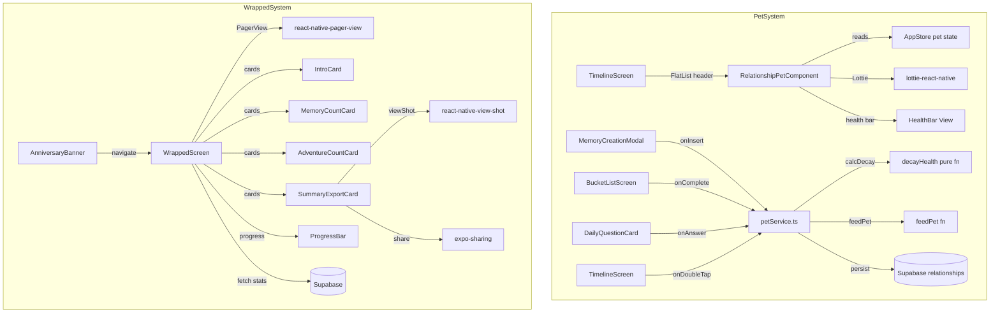

# Design Document: Gamification & Virality

## Overview

This design adds two engagement systems to the WeDo couples app:

1. **Relationship Pet** — A Tamagotchi-style virtual companion rendered as a Lottie animation on the TimelineScreen. Health decays client-side over time; couples feed it by performing in-app actions (creating memories, completing bucket list items, answering daily questions, double-tap hearts). The pet evolves through four stages (Egg → Baby → Teen → Adult) based on cumulative XP. All state lives on the existing `relationships` table — no new tables, no cron jobs, $0 server cost.

2. **Relationship Wrapped** — An Instagram-Story-style year-in-review that replaces the existing `YearInReviewModal` FlatList with `react-native-pager-view` for native horizontal snapping. The final card includes a "Made with WeDo" watermark and can be exported as a JPG via `react-native-view-shot` + `expo-sharing` for social sharing.

### New Dependencies

| Package | Purpose |
|---------|---------|
| `react-native-view-shot` | Capture Wrapped summary card as JPG |
| `expo-sharing` | Open native share sheet |
| `react-native-pager-view` | Horizontal snapping pager for Wrapped cards |

Existing `lottie-react-native` is reused for pet animations.

## Architecture



### Data Flow

**Pet System:**
1. App loads → `petService.loadPetState(relationshipId)` fetches `pet_health`, `pet_total_xp`, `pet_last_fed_at` from `relationships` row
2. Client computes decay: `newHealth = max(0, pet_health - (daysSinceLastFed × 15))`
3. If health changed, persist updated `pet_health` back to Supabase
4. Store pet state in `AppStore` for reactive UI
5. Feeding actions call `petService.feedPet(relationshipId, healthBoost, xpBoost)` which updates Supabase + store
6. If health hits 0 and 7+ days inactive, schedule local notification

**Wrapped System:**
1. User taps AnniversaryBanner → navigates to `WrappedScreen` (replaces `YearInReviewModal`)
2. Screen fetches memory count + completed bucket list count for past year
3. Renders 4 cards in `PagerView` with horizontal snapping
4. Progress bar updates on page change
5. Summary card: `viewShot.capture()` → `Sharing.shareAsync(uri)`

## Components and Interfaces

### 1. petService.ts (New)

**File**: `src/services/petService.ts`

Pure functions + Supabase persistence for pet logic. No UI.

```typescript
export interface PetState {
  petName: string;
  petHealth: number;       // 0–100
  petTotalXp: number;
  petLastFedAt: string;    // ISO timestamp
}

export type EvolutionStage = 'egg' | 'baby' | 'teen' | 'adult';

/** Pure: compute health after decay */
export function decayHealth(currentHealth: number, lastFedAt: string, now: Date): number;

/** Pure: derive evolution stage from XP */
export function getEvolutionStage(totalXp: number): EvolutionStage;

/** Pure: derive mood from health */
export function getPetMood(health: number): 'happy' | 'sad';

/** Fetch pet state from relationships row, apply decay, persist if changed */
export async function loadAndDecayPet(relationshipId: string): Promise<PetState>;

/** Apply a feeding action: increment health (capped 100) + XP, update last_fed_at */
export async function feedPet(
  relationshipId: string,
  healthBoost: number,
  xpBoost: number
): Promise<PetState>;

/** Check if notification should be scheduled (health=0, 7+ days inactive) */
export function shouldScheduleInactivityNotification(
  petHealth: number,
  lastFedAt: string,
  now: Date
): boolean;
```

### 2. RelationshipPet Component (New)

**File**: `src/components/RelationshipPet.tsx`

Renders above `AnniversaryBanner` in the TimelineScreen FlatList `ListHeaderComponent`.

```typescript
interface RelationshipPetProps {
  petState: PetState;
}
```

Renders:
- Pet name text above animation
- `LottieView` with animation source based on `getEvolutionStage(xp)` + `getPetMood(health)`
- Health bar: `View` with width = `petHealth%`, background `#FF7F50`

Animation files: `assets/animations/pet-egg-happy.json`, `pet-egg-sad.json`, `pet-baby-happy.json`, etc. (8 total: 4 stages × 2 moods).

### 3. AppStore Extensions (Modified)

**File**: `src/store/appStore.ts`

```typescript
// New fields added to AppStore interface:
petName: string | null;
petHealth: number;
petTotalXp: number;
petLastFedAt: string | null;
setPetState: (state: PetState) => void;
```

### 4. TimelineScreen (Modified)

**File**: `src/screens/TimelineScreen.tsx`

- Import `RelationshipPet` and `petService`
- On mount (when `relationshipId` exists): call `loadAndDecayPet`, store result via `setPetState`
- Update `ListHeaderComponent` to render `RelationshipPet` above `AnniversaryBanner`
- In `handleDoubleTap`: call `feedPet(relationshipId, 5, 5)` after the like upsert

### 5. WrappedScreen (New, replaces YearInReviewModal)

**File**: `src/screens/WrappedScreen.tsx`

Replaces the existing `YearInReviewModal` with a `PagerView`-based implementation.

```typescript
// Navigation type update
export type RootStackParamList = {
  // ... existing
  WrappedScreen: undefined;  // replaces YearInReviewModal
};
```

Structure:
- `PagerView` with 4 pages, horizontal orientation, `scrollEnabled`
- `onPageSelected` callback updates `activeIndex` state
- Progress bar at top: array of segment views, filled based on `activeIndex`
- Close button (top-right)
- Each page is a full-screen card with `MeshGradient` background + animated text

### 6. SummaryExportCard (New)

**File**: `src/components/SummaryExportCard.tsx`

The final Wrapped card, wrapped in a `ViewShot` ref for capture.

```typescript
interface SummaryExportCardProps {
  memoryCount: number;
  adventureCount: number;
  onShare: () => void;
}
```

Renders:
- Stats summary (memory count, adventure count)
- "Made with WeDo" watermark text
- Share button that triggers `onShare`

Share flow in parent (`WrappedScreen`):
```typescript
const viewShotRef = useRef<ViewShot>(null);

async function handleShare() {
  const uri = await viewShotRef.current?.capture?.();
  if (!uri) { /* show error */ return; }
  const available = await Sharing.isAvailableAsync();
  if (!available) { /* show unsupported message */ return; }
  await Sharing.shareAsync(uri, { mimeType: 'image/jpeg' });
}
```

### 7. Feeding Integration Points (Modified)

Existing components that trigger feeding:

| Component | Action | Health | XP |
|-----------|--------|--------|----|
| `MemoryCreationModal` | Memory insert success | +20 | +20 |
| `BucketListScreen` | Item marked complete | +20 | +20 |
| `DailyQuestionCard` | Question answered | +20 | +20 |
| `TimelineScreen` (MemoryCard) | Double-tap heart | +5 | +5 |

Each calls `petService.feedPet(relationshipId, healthBoost, xpBoost)` after the primary action succeeds.

### 8. Notification Scheduling (New)

**File**: `src/services/petService.ts` (within `loadAndDecayPet`)

After decay calculation, if `shouldScheduleInactivityNotification` returns true:
- Use `expo-notifications` `scheduleNotificationAsync` with immediate trigger
- Content: `{ title: "WeDo", body: "Your pet misses you both! 🥺" }`
- Wrap in try/catch — if notifications are disabled at OS level, silently skip

## Data Models

### Modified: `relationships` table (Supabase)

Four new columns added to the existing `relationships` table:

```sql
ALTER TABLE relationships
  ADD COLUMN pet_name TEXT DEFAULT 'Buddy',
  ADD COLUMN pet_health INTEGER DEFAULT 100 CHECK (pet_health >= 0 AND pet_health <= 100),
  ADD COLUMN pet_total_xp INTEGER DEFAULT 0 CHECK (pet_total_xp >= 0),
  ADD COLUMN pet_last_fed_at TIMESTAMPTZ DEFAULT NOW();
```

No new tables. This keeps the $0 server cost architecture intact — no additional RLS policies needed beyond the existing relationship-level policy.

### PetState (TypeScript)

```typescript
export interface PetState {
  petName: string;
  petHealth: number;       // 0–100, integer
  petTotalXp: number;      // >= 0, integer
  petLastFedAt: string;    // ISO 8601 timestamp
}
```

### EvolutionStage (Derived, not stored)

```typescript
export type EvolutionStage = 'egg' | 'baby' | 'teen' | 'adult';

// Thresholds:
// egg:   0–99 XP
// baby:  100–499 XP
// teen:  500–999 XP
// adult: 1000+ XP
```

### WrappedStats (Local, not persisted)

```typescript
interface WrappedStats {
  memoryCount: number;
  adventureCount: number;  // completed bucket list items in past year
}
```

### Navigation Type Update

```typescript
export type RootStackParamList = {
  // ... existing entries unchanged
  WrappedScreen: undefined;  // replaces YearInReviewModal
};
```


## Correctness Properties

*A property is a characteristic or behavior that should hold true across all valid executions of a system — essentially, a formal statement about what the system should do. Properties serve as the bridge between human-readable specifications and machine-verifiable correctness guarantees.*

### Property 1: Decay health formula with floor

From prework: 2.1 defines the decay formula (`days_elapsed × 15`) and 2.2 requires the result never goes below 0. These are two aspects of the same pure function, so we combine them.

*For any* pet health value (0–100), any `lastFedAt` timestamp, and any current time `now` where `now >= lastFedAt`, `decayHealth(health, lastFedAt, now)` shall equal `Math.max(0, health - Math.floor(daysBetween(lastFedAt, now)) * 15)`.

**Validates: Requirements 2.1, 2.2**

### Property 2: Feeding function correctness

From prework: 3.1–3.4 all test the same feeding function with different boost values. We generalize into one property covering all boost amounts.

*For any* pet health (0–100), any pet XP (≥ 0), any health boost (> 0), and any XP boost (> 0), applying a feed action shall produce `newHealth = Math.min(100, health + healthBoost)` and `newXp = xp + xpBoost`, and `newLastFedAt` shall be a timestamp no earlier than the previous `lastFedAt`.

**Validates: Requirements 3.1, 3.2, 3.3, 3.4**

### Property 3: Evolution stage derivation

From prework: 4.1 defines a pure mapping from XP to stage with specific thresholds.

*For any* non-negative integer `totalXp`, `getEvolutionStage(totalXp)` shall return `'egg'` when `totalXp < 100`, `'baby'` when `100 <= totalXp < 500`, `'teen'` when `500 <= totalXp < 1000`, and `'adult'` when `totalXp >= 1000`.

**Validates: Requirements 4.1**

### Property 4: Pet mood derivation

From prework: 5.2 and 5.3 test the same mood function from opposite sides of the threshold. Combined into one property.

*For any* pet health value (0–100), `getPetMood(health)` shall return `'sad'` when `health < 30` and `'happy'` when `health >= 30`.

**Validates: Requirements 5.2, 5.3**

### Property 5: Inactivity notification condition

From prework: 6.1 defines when a notification should be scheduled.

*For any* pet health value and any `lastFedAt` timestamp relative to `now`, `shouldScheduleInactivityNotification(health, lastFedAt, now)` shall return `true` if and only if `health === 0` AND the number of full days between `lastFedAt` and `now` is 7 or more.

**Validates: Requirements 6.1**

### Property 6: Wrapped progress calculation

From prework: 9.1 defines progress as a ratio of current position to total cards.

*For any* active card index (0-based) and total card count (> 0), the progress value shall equal `(activeIndex + 1) / totalCards`, and shall always be in the range `(0, 1]`.

**Validates: Requirements 9.1**

## Error Handling

### Pet Decay Persistence Failure
- If the Supabase update for decayed health fails, keep the locally computed value in `AppStore` for the current session
- On next app load, decay will be recalculated from the stale `pet_last_fed_at` — self-healing
- No user-facing error for background decay sync

### Feeding Persistence Failure
- If `feedPet` Supabase update fails, show a brief toast/alert: "Couldn't save pet update"
- The optimistic local state update in `AppStore` remains — user sees the health/XP change
- Next successful feed will persist the correct cumulative values since `pet_last_fed_at` is updated

### Notification Scheduling Failure (Req 6.3)
- Wrap `scheduleNotificationAsync` in try/catch
- If notifications are disabled at OS level, `getPermissionsAsync` returns denied — skip silently
- No error shown to user; notification is a nice-to-have, not critical

### View Shot Capture Failure (Req 8.4)
- If `viewShotRef.current?.capture()` returns undefined or throws, display an alert: "Couldn't capture image. Please try again."
- Do not proceed to share sheet

### Share Sheet Unavailable (Req 8.5)
- Check `Sharing.isAvailableAsync()` before calling `shareAsync`
- If unavailable, display alert: "Sharing is not supported on this device"

### Lottie Animation Load Failure
- If a pet animation JSON fails to load, render a static emoji fallback (🥚🐣🐥🐔 based on stage)
- Wrap `LottieView` source in a conditional check

## Testing Strategy

### Property-Based Testing

**Library**: `fast-check` (already in devDependencies)

**Configuration**: Each property test runs a minimum of 100 iterations.

**Tag format**: Each test includes a comment: `// Feature: gamification-virality, Property {N}: {title}`

Each correctness property maps to a single `fast-check` test:

| Property | Test Target | Generator Strategy |
|----------|-------------|-------------------|
| 1: Decay health formula | `decayHealth(health, lastFedAt, now)` | `fc.integer({min:0,max:100})` for health, `fc.date()` pairs where now >= lastFedAt |
| 2: Feeding correctness | `applyFeed(health, xp, healthBoost, xpBoost)` | `fc.integer({min:0,max:100})`, `fc.nat()`, `fc.integer({min:1,max:100})` for boosts |
| 3: Evolution stage | `getEvolutionStage(totalXp)` | `fc.nat({max:5000})` |
| 4: Pet mood | `getPetMood(health)` | `fc.integer({min:0,max:100})` |
| 5: Inactivity notification | `shouldScheduleInactivityNotification(health, lastFedAt, now)` | `fc.integer({min:0,max:100})`, `fc.date()` pairs |
| 6: Wrapped progress | `calculateProgress(activeIndex, totalCards)` | `fc.nat({max:20})` for index, `fc.integer({min:1,max:20})` for total (with index < total) |

### Unit Tests

Unit tests complement property tests for specific examples and edge cases:

- **Req 1.1/1.2**: Pet initialization produces health=100, xp=0, stage='egg'
- **Req 2.1**: Decay after exactly 0 days = no change; decay after 7 days from health 100 = 100 - 105 = 0 (capped)
- **Req 3.4**: Double-tap heart from health 98 → health 100 (cap test)
- **Req 4.1**: Boundary values: xp=99→egg, xp=100→baby, xp=499→baby, xp=500→teen, xp=999→teen, xp=1000→adult
- **Req 5.2/5.3**: Boundary: health=29→sad, health=30→happy
- **Req 6.3**: Notification scheduling when permissions denied → no error thrown
- **Req 7.2**: Wrapped pages array has exactly 4 items in correct order
- **Req 8.1**: SummaryExportCard renders "Made with WeDo" text
- **Req 8.4**: Share handler shows error when capture returns undefined
- **Req 8.5**: Share handler shows unsupported message when `isAvailableAsync` returns false

### Test File Organization

```
src/
  services/__tests__/
    petService.test.ts              — Pure function unit tests + property tests for decay, feeding, evolution, mood
    petService.property.test.ts     — Property-based tests (Properties 1–5)
  screens/__tests__/
    WrappedScreen.test.tsx          — Page order, progress calculation, share flow
    WrappedScreen.property.test.ts  — Property-based test (Property 6)
  components/__tests__/
    RelationshipPet.test.tsx        — Rendering, animation source selection
    SummaryExportCard.test.tsx      — Watermark text, share button
```

Pure logic (`decayHealth`, `getEvolutionStage`, `getPetMood`, `shouldScheduleInactivityNotification`, `calculateProgress`) is extracted into `petService.ts` and a small `wrappedUtils.ts` to enable clean property-based testing without component rendering overhead.
