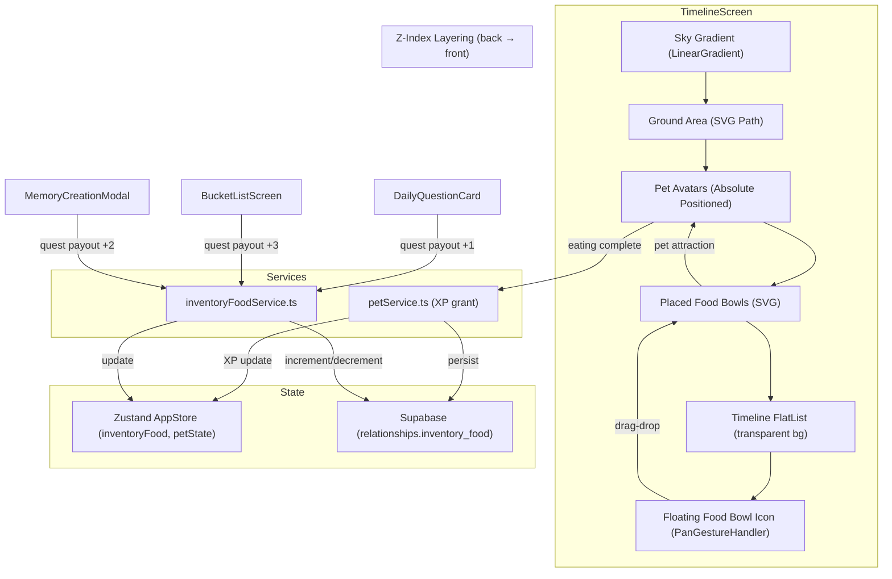
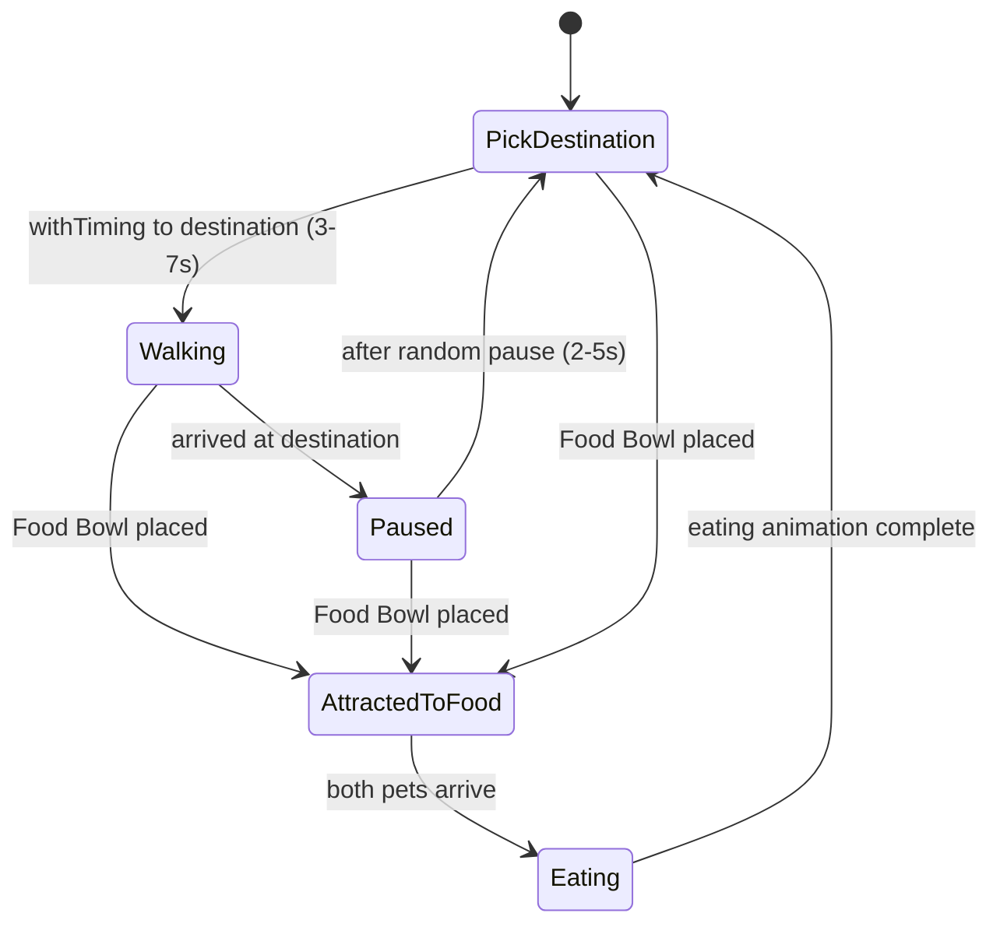

# Design Document: Garden Metaverse & Quest Engine

## Overview

This design transforms the existing `TimelineScreen` from a flat memory feed into an immersive interactive garden with three interconnected systems:

1. **Garden Background** — A time-of-day sky gradient (`expo-linear-gradient`) and SVG ground terrain (`react-native-svg`) replace the solid `#FAFAFA` background. The timeline FlatList becomes transparent, floating over the garden.

2. **Autonomous Pet Roaming** — The existing `LinkedCompanions` component is restructured so pet avatars are absolutely positioned within the garden ground area. A roaming engine drives pets to wander randomly using Reanimated shared values, with boundary clamping to the ground region.

3. **Quest & Feeding Loop** — Users earn Food Bowls by completing in-app tasks (daily question, bucket list, memory upload). A floating Food Bowl icon shows inventory count. Users drag-drop food into the garden, attracting pets who eat it for XP toward evolution.

### Key Design Decisions

- **No new screens**: Everything lives within the existing `TimelineScreen` as layered absolute-positioned views.
- **Zustand for food state**: `inventoryFood` is added to the existing `AppStore` alongside pet state, keeping reactive state centralized.
- **Centralized food service**: A new `inventoryFoodService.ts` handles all increment/decrement logic, called from quest payout sites and the feeding interaction.
- **Roaming as a custom hook**: `useRoamingEngine(petId, groundBounds)` encapsulates the pick-destination → walk → pause loop using Reanimated `withTiming` and `withDelay`, returning animated styles.
- **PanGestureHandler for drag**: The drag-to-feed interaction uses `react-native-gesture-handler`'s `PanGestureHandler` with Reanimated worklet callbacks.

## Architecture



### Roaming Engine Flow



## Components and Interfaces

### New Components

#### `GardenBackground`
- **Location**: `src/components/GardenBackground.tsx`
- **Purpose**: Renders the sky gradient and SVG ground terrain as absolute-positioned layers behind all content.
- **Props**: None (reads current hour internally)
- **Renders**: `<LinearGradient>` for sky + `<Svg><Path>` for ground
- **Exports**: `getGradientColorsForHour(hour: number): string[]` (pure, testable)

#### `GardenPetLayer`
- **Location**: `src/components/GardenPetLayer.tsx`
- **Purpose**: Renders both pet avatars with absolute positioning within the ground area, driven by the roaming engine.
- **Props**: `{ myPet: Pet | null, partnerPet: Pet | null, foodPosition: {x, y} | null, onEatingComplete: () => void }`
- **Uses**: `useRoamingEngine` hook for each pet

#### `FoodBowlOverlay`
- **Location**: `src/components/FoodBowlOverlay.tsx`
- **Purpose**: Floating food bowl icon with badge count + PanGestureHandler for drag-to-feed.
- **Props**: `{ inventoryFood: number, groundBounds: {top, bottom, left, right}, onFoodPlaced: (x: number, y: number) => void }`

#### `PlacedFoodBowl`
- **Location**: `src/components/PlacedFoodBowl.tsx`
- **Purpose**: SVG food bowl rendered at drop coordinates on the ground. Removed after pets eat.
- **Props**: `{ x: number, y: number, visible: boolean }`

### New Hooks

#### `useRoamingEngine`
- **Location**: `src/hooks/useRoamingEngine.ts`
- **Signature**: `useRoamingEngine(groundBounds: GroundBounds, enabled: boolean): { animatedStyle: AnimatedStyleProp, setAttractTarget: (pos: {x, y} | null) => void, facingDirection: SharedValue<'left' | 'right'> }`
- **Behavior**: Runs the pick → walk → pause loop using Reanimated shared values. When `setAttractTarget` is called with a position, interrupts roaming and moves to that position at faster speed (1-2s). When called with `null`, resumes roaming.

#### `useTimeOfDay`
- **Location**: `src/hooks/useTimeOfDay.ts`
- **Signature**: `useTimeOfDay(): 'dawn' | 'day' | 'sunset' | 'night'`
- **Behavior**: Returns current time period. Recalculates on mount and on AppState `active` event.

### New Services

#### `inventoryFoodService.ts`
- **Location**: `src/services/inventoryFoodService.ts`
- **Functions**:
  - `fetchFoodInventory(relationshipId: string): Promise<number>`
  - `incrementFood(relationshipId: string, amount: number): Promise<number>` — returns new count
  - `decrementFood(relationshipId: string, amount: number): Promise<number>` — throws if would go negative

### Modified Components

#### `TimelineScreen.tsx`
- Replace solid background with `<GardenBackground />`
- Add `<GardenPetLayer />` and `<FoodBowlOverlay />` as absolute-positioned siblings
- Set FlatList `backgroundColor: 'transparent'`
- Remove `LinkedCompanions` from FlatList `ListHeaderComponent` (pets now in garden layer)
- Fetch `inventoryFood` on mount, manage food placement state
- Orchestrate feeding flow: drag → place → attract → eat → XP → resume

#### `AppStore` (appStore.ts)
- Add `inventoryFood: number` (default 0)
- Add `setInventoryFood: (value: number) => void`

#### `DailyQuestionCard.tsx`
- After `markDiscussed` succeeds, call `incrementFood(relationshipId, 1)`

#### `BucketListScreen.tsx`
- In `handleToggleComplete`, when transitioning incomplete → complete, call `incrementFood(relationshipId, 3)`

#### `MemoryCreationModal.tsx`
- After successful memory insert, call `incrementFood(relationshipId, 2)`

### Interfaces

```typescript
// Ground area bounds (in screen coordinates)
interface GroundBounds {
  top: number;    // Y coordinate where ground starts (60% of screen height)
  bottom: number; // Y coordinate where ground ends (screen height)
  left: number;   // X coordinate left edge (10% of screen width)
  right: number;  // X coordinate right edge (90% of screen width)
}

// Time-of-day period
type TimeOfDay = 'dawn' | 'day' | 'sunset' | 'night';

// Sky gradient palette
interface SkyPalette {
  colors: string[];
  locations?: number[];
}

// Food placement event
interface FoodPlacement {
  x: number;
  y: number;
  timestamp: number;
}
```

## Data Models

### Database Changes

#### `relationships` table — new column

| Column | Type | Default | Constraints |
|--------|------|---------|-------------|
| `inventory_food` | `integer` | `0` | `CHECK (inventory_food >= 0)` |

**Migration SQL:**
```sql
ALTER TABLE relationships
ADD COLUMN inventory_food integer NOT NULL DEFAULT 0
CHECK (inventory_food >= 0);
```

### Zustand Store Additions

```typescript
// Added to AppStore interface
inventoryFood: number;           // default 0
setInventoryFood: (value: number) => void;
```

### Sky Gradient Palettes

```typescript
const SKY_PALETTES: Record<TimeOfDay, SkyPalette> = {
  dawn:    { colors: ['#FFDAB9', '#FFE4B5', '#FFF8DC'] },
  day:     { colors: ['#87CEEB', '#B0E0E6', '#F0F8FF'] },
  sunset:  { colors: ['#FF8C00', '#FF6347', '#8B008B'] },
  night:   { colors: ['#0D1B2A', '#1B2838', '#2C1654'] },
};
```

### Time-of-Day Mapping (pure function)

```typescript
function getTimeOfDay(hour: number): TimeOfDay {
  if (hour >= 5 && hour <= 10) return 'dawn';
  if (hour >= 11 && hour <= 16) return 'day';
  if (hour >= 17 && hour <= 20) return 'sunset';
  return 'night'; // 21-4
}
```

### Roaming Engine Constants

```typescript
const ROAM_CONFIG = {
  minWalkDuration: 3000,  // ms
  maxWalkDuration: 7000,  // ms
  minPauseDuration: 2000, // ms
  maxPauseDuration: 5000, // ms
  attractSpeed: 1500,     // ms (fixed, faster than roaming)
  boundaryPadding: 0.1,   // 10% screen width inset
  groundTopRatio: 0.6,    // ground starts at 60% of screen height
};
```


## Correctness Properties

*A property is a characteristic or behavior that should hold true across all valid executions of a system — essentially, a formal statement about what the system should do. Properties serve as the bridge between human-readable specifications and machine-verifiable correctness guarantees.*

### Property 1: Hour-to-palette mapping covers all 24 hours correctly

*For any* integer hour in [0, 23], `getTimeOfDay(hour)` shall return `'dawn'` for hours 5–10, `'day'` for hours 11–16, `'sunset'` for hours 17–20, and `'night'` for hours 21–23 and 0–4. Every hour maps to exactly one palette with no gaps or overlaps.

**Validates: Requirements 1.2, 1.3, 1.4, 1.5**

### Property 2: Ground SVG scales proportionally to screen dimensions

*For any* positive screen width and height, the generated ground SVG path coordinates shall scale proportionally such that the ground area occupies the bottom 40% of the screen height and spans the full screen width.

**Validates: Requirements 2.3**

### Property 3: Generated roam destinations are within ground bounds

*For any* screen dimensions (width > 0, height > 0), a generated roam destination shall have X in [0.1 × width, 0.9 × width] and Y in [0.6 × height, height]. No generated destination shall fall outside these bounds.

**Validates: Requirements 4.2, 5.1, 5.2**

### Property 4: Clamping produces valid coordinates and is idempotent

*For any* arbitrary (x, y) coordinate and valid ground bounds, `clampToGroundBounds(x, y, bounds)` shall return a coordinate within bounds. Furthermore, clamping an already-valid coordinate shall return the same coordinate unchanged (idempotence).

**Validates: Requirements 5.3**

### Property 5: Walk and pause durations are within configured ranges

*For any* two valid positions within the ground area, the computed walk duration shall be in [3000, 7000] ms. *For any* generated pause duration, it shall be in [2000, 5000] ms.

**Validates: Requirements 4.3, 4.6**

### Property 6: Facing direction matches travel direction

*For any* current position (cx, cy) and destination position (dx, dy) where dx ≠ cx, the facing direction shall be `'right'` when dx > cx and `'left'` when dx < cx.

**Validates: Requirements 4.4, 12.2**

### Property 7: Food inventory increment/decrement round trip

*For any* non-negative starting inventory value and any positive amount where amount ≤ starting value, incrementing by amount then decrementing by the same amount shall return the inventory to the starting value.

**Validates: Requirements 16.1, 16.2**

### Property 8: Decrement rejects negative inventory

*For any* non-negative starting inventory value and any positive amount where amount > starting value, `decrementFood` shall reject the operation and leave the inventory unchanged.

**Validates: Requirements 16.3**

### Property 9: Drop validation matches ground bounds

*For any* drop coordinate (x, y) and valid ground bounds, the drop is valid if and only if x is within [bounds.left, bounds.right] and y is within [bounds.top, bounds.bottom]. Valid drops result in food placement; invalid drops result in cancellation with no inventory change.

**Validates: Requirements 11.2, 11.5**

### Property 10: Bucket list payout only on incomplete-to-complete transition

*For any* sequence of toggle operations on a bucket list item, `incrementFood` shall be called only when the item transitions from incomplete to complete (false → true). Toggling from complete to incomplete (true → false) shall never trigger a food increment or decrement.

**Validates: Requirements 8.2, 8.3**

### Property 11: Evolution stage threshold crossing detection

*For any* current XP value and positive XP gain, an evolution stage change is detected if and only if `getEvolutionStage(currentXp)` differs from `getEvolutionStage(currentXp + xpGain)`. The stage thresholds are: egg [0, 99], baby [100, 499], teen [500, 999], adult [1000+].

**Validates: Requirements 13.3**

## Error Handling

| Scenario | Behavior |
|----------|----------|
| `incrementFood` DB update fails during quest payout | Silently ignore error; do not block the primary action (question discussion, bucket list toggle, memory creation). Log warning if debug mode. |
| `decrementFood` would result in negative inventory | Reject operation, return error. Do not modify DB or AppStore. UI prevents drag when count is 0. |
| `fetchFoodInventory` fails on mount | Default to `inventoryFood: 0` in AppStore. Food Bowl icon shows 0 / dimmed state. |
| Pet XP update fails after feeding | Silently ignore. XP will reconcile on next screen mount via `loadAndDecayPet`. |
| Roaming engine receives invalid ground bounds (e.g., zero dimensions) | Skip roaming; pets remain at initial position. No crash. |
| Drag released outside ground bounds | Cancel placement, animate food bowl sprite back to icon position. No inventory change. |
| Food placement while pets are already attracted to food | Queue the new food placement; process after current eating completes. |
| Network disconnection during food increment | Optimistic local update. On reconnect, the next `fetchFoodInventory` reconciles state. |

## Testing Strategy

### Unit Tests

Unit tests cover specific examples, edge cases, and integration points:

- `getTimeOfDay` returns correct period for boundary hours (5, 10, 11, 16, 17, 20, 21, 0, 4)
- `getGradientColorsForHour` returns the correct color array for each time period
- Ground SVG path generation for a known screen size (e.g., 390×844)
- `clampToGroundBounds` with coordinates already inside bounds (no-op)
- `clampToGroundBounds` with coordinates outside each edge
- `incrementFood` / `decrementFood` with mocked Supabase calls
- `decrementFood` rejection when amount > current inventory
- `fetchFoodInventory` returns correct value from mock
- AppStore `setInventoryFood` updates state correctly
- `getEvolutionStage` at exact thresholds (0, 99, 100, 499, 500, 999, 1000)
- Food Bowl icon renders dimmed when inventory is 0
- Quest payout amounts: daily question = 1, bucket list = 3, memory = 2

### Property-Based Tests

Property-based tests use `fast-check` (the standard PBT library for TypeScript/JavaScript). Each test runs a minimum of 100 iterations.

Each property test references its design document property with a tag comment:

```typescript
// Feature: garden-metaverse-quest-engine, Property 1: Hour-to-palette mapping covers all 24 hours correctly
```

Properties to implement:

1. **Property 1**: Generate random hours 0–23, verify `getTimeOfDay` returns the correct period with full coverage and no gaps.
2. **Property 2**: Generate random positive screen dimensions, verify ground SVG coordinates scale to bottom 40%.
3. **Property 3**: Generate random screen dimensions, verify all generated roam destinations are within [10%–90% width, 60%–100% height].
4. **Property 4**: Generate arbitrary coordinates, verify clamping produces valid results and is idempotent.
5. **Property 5**: Generate random position pairs within bounds, verify walk duration ∈ [3000, 7000] ms. Generate random pause durations, verify ∈ [2000, 5000] ms.
6. **Property 6**: Generate random (current, destination) coordinate pairs where x differs, verify facing direction matches.
7. **Property 7**: Generate random non-negative inventory and valid amounts, verify increment then decrement round-trips.
8. **Property 8**: Generate random inventory and amounts where amount > inventory, verify rejection.
9. **Property 9**: Generate random drop coordinates and ground bounds, verify drop validity matches bounds containment.
10. **Property 10**: Generate random sequences of boolean toggles, verify increment is called only on false→true transitions.
11. **Property 11**: Generate random XP values and gains, verify stage change detection matches threshold crossing.

### Test Configuration

- **PBT Library**: `fast-check` (npm package)
- **Minimum iterations**: 100 per property test
- **Test runner**: Jest (existing project setup)
- **Test location**: `src/services/__tests__/` and `src/components/__tests__/` alongside existing test directories
