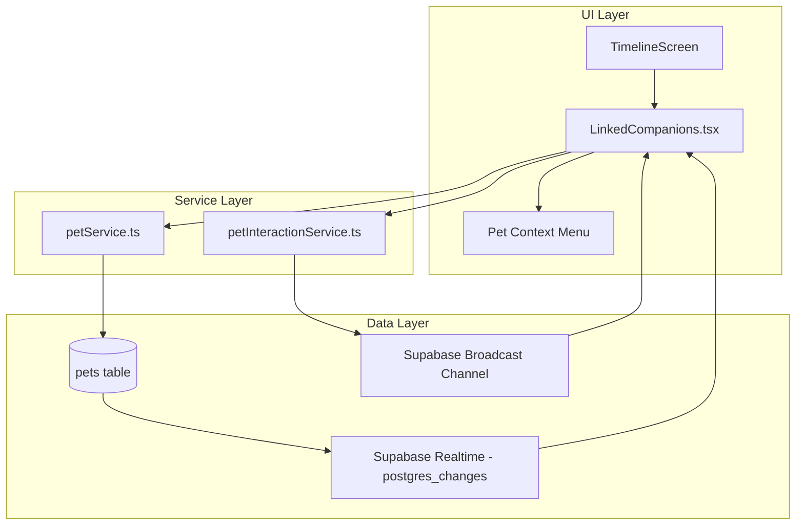

# Design Document: Linked Companions

## Overview

The Linked Companions feature transforms the existing single shared pet (stored on the `relationships` table) into a dual-avatar system where each user in a relationship owns an independent pet. Both pets are rendered side-by-side in a shared "Pet Room" UI, and users can interact with their partner's pet in real-time via Supabase Broadcast channels.

The system introduces three main layers:
1. **Data Layer** — A new `pets` table with RLS policies, decoupled from `relationships`.
2. **Service Layer** — An extended `petService.ts` for CRUD/health and a new `petInteractionService.ts` for real-time broadcast interactions.
3. **UI Layer** — A new `LinkedCompanions.tsx` component replacing the single `RelationshipPet.tsx` in the `TimelineScreen` header.

The existing `petService.ts` pure functions (`decayHealth`, `getEvolutionStage`, `getPetMood`) remain unchanged. The `loadAndDecayPet` and `feedPet` functions will be adapted to operate on the new `pets` table instead of `relationships`.

## Architecture



### Data Flow

1. **On mount**: `TimelineScreen` fetches both pets from the `pets` table via `petService`, passes them as props to `LinkedCompanions`.
2. **Real-time DB changes**: The `pets` table is in the `supabase_realtime` publication. Health/state changes propagate via `postgres_changes` subscriptions.
3. **Interactions**: Tapping the partner's pet sends a broadcast message on `pet-room:{relationshipId}`. The partner's client receives it, triggers haptics and animation. `feed` interactions also persist a health update to the DB.
4. **Lifecycle**: The broadcast channel is created on `LinkedCompanions` mount and torn down on unmount, integrated with `realtimeManager.unsubscribeAll()`.

## Components and Interfaces

### 1. `Pet` Type (shared)

```typescript
export type Archetype = 'cat' | 'dog' | 'bunny' | 'bear';
export type Personality = 'energetic' | 'grumpy' | 'sleepy' | 'shy';
export type InteractionType = 'poke' | 'hug' | 'feed' | 'kiss';

export interface Pet {
  id: string;
  user_id: string;
  relationship_id: string;
  name: string;
  archetype: Archetype;
  color_hex: string;
  personality: Personality;
  health: number;
  created_at: string;
  updated_at: string;
}
```

### 2. `petService.ts` (extended)

Existing pure functions remain. New functions added:

```typescript
// Fetch both pets for a relationship
export async function fetchPetsForRelationship(relationshipId: string): Promise<Pet[]>;

// Create a new pet for the authenticated user
export async function createPet(params: {
  name: string;
  archetype: Archetype;
  color_hex: string;
  personality: Personality;
  relationshipId: string;
}): Promise<Pet>;

// Apply health decay to a single pet based on its updated_at
export function decayPetHealth(pet: Pet, now: Date): number;

// Increase a pet's health by amount (capped at 100), persist to DB
export async function boostPetHealth(petId: string, amount: number): Promise<void>;
```

Validation logic:
- `archetype` must be one of the four allowed values.
- `personality` must be one of the four allowed values.
- `color_hex` must match `/^#[0-9A-Fa-f]{6}$/`.
- Duplicate pet creation is rejected (UNIQUE constraint on `user_id` surfaces as a Postgres error).

### 3. `petInteractionService.ts` (new)

```typescript
export interface InteractionPayload {
  type: InteractionType;
  fromUserId: string;
  targetPetId: string;
  timestamp: number;
}

export type InteractionCallback = (payload: InteractionPayload) => void;

// Subscribe to the pet-room broadcast channel
export function subscribeToPetRoom(
  relationshipId: string,
  currentUserId: string,
  onInteraction: InteractionCallback
): RealtimeChannel;

// Send an interaction broadcast
export function sendInteraction(
  channel: RealtimeChannel,
  payload: InteractionPayload
): void;

// Queue for offline retry
// Internal queue that flushes when channel status becomes SUBSCRIBED
```

Key behaviors:
- Channel name: `pet-room:{relationshipId}`
- Self-echo filtering: messages where `fromUserId === currentUserId` are ignored in the callback.
- Offline queue: interactions are queued in memory if the channel is not connected, and flushed on reconnect.
- Cleanup integrates with `realtimeManager.unsubscribeAll()` by pushing the channel to the shared `activeChannels` array.

### 4. `LinkedCompanions.tsx` (new component)

Props:
```typescript
interface LinkedCompanionsProps {
  myPet: Pet | null;
  partnerPet: Pet | null;
  relationshipId: string;
}
```

Responsibilities:
- Renders a glassmorphism container (semi-transparent background + blur via `expo-blur` or `rgba` + `borderRadius`).
- Renders two pet avatars side-by-side: user's pet on the left, partner's pet on the right.
- Each pet is an emoji representation (archetype → emoji mapping) tinted with `color_hex`.
- Idle breathing animation via `react-native-reanimated` (`withRepeat` + `withSequence` + `withTiming`).
- Eye tracking follows touch position (reuses the pattern from `RelationshipPet.tsx`).
- Tap on partner's pet → sends `poke` interaction.
- Long-press on partner's pet → shows context menu with `hug`, `feed`, `kiss`.
- Tapping own pet is a no-op (gestures disabled on own avatar).
- Displays pet names below each avatar.
- Displays a health bar for each pet.
- Displays a status text showing the last interaction (e.g., "Partner poked your cat!").
- On receiving an interaction: triggers haptic feedback (`expo-haptics`) and plays a reaction animation (bounce/glow/sparkle/heart-pulse depending on type).

### 5. `TimelineScreen.tsx` (modified)

Changes:
- Add `pets` state: `useState<Pet[]>([])`.
- Fetch pets in the existing `useEffect` that runs on `relationshipId` change.
- Derive `myPet` and `partnerPet` from the `pets` array using `currentUserId`.
- Replace `RelationshipPet` in `ListHeaderComponent` with `LinkedCompanions` when `pets.length > 0`.
- Omit `LinkedCompanions` when `pets.length === 0`.

## Data Models

### `pets` Table

| Column          | Type          | Constraints                                                    |
|-----------------|---------------|----------------------------------------------------------------|
| `id`            | `uuid`        | PRIMARY KEY, DEFAULT `gen_random_uuid()`                       |
| `user_id`       | `uuid`        | NOT NULL, UNIQUE, REFERENCES `auth.users(id)`                  |
| `relationship_id` | `uuid`     | NOT NULL, REFERENCES `relationships(id)`                       |
| `name`          | `text`        | NOT NULL                                                       |
| `archetype`     | `text`        | NOT NULL, CHECK (`archetype` IN ('cat','dog','bunny','bear'))  |
| `color_hex`     | `text`        | NOT NULL, CHECK (`color_hex` ~ '^#[0-9A-Fa-f]{6}$')           |
| `personality`   | `text`        | NOT NULL, CHECK (`personality` IN ('energetic','grumpy','sleepy','shy')) |
| `health`        | `integer`     | NOT NULL, DEFAULT 100, CHECK (`health` >= 0 AND `health` <= 100) |
| `created_at`    | `timestamptz` | NOT NULL, DEFAULT `now()`                                      |
| `updated_at`    | `timestamptz` | NOT NULL, DEFAULT `now()`                                      |

### SQL Migration

```sql
CREATE TABLE pets (
  id            uuid PRIMARY KEY DEFAULT gen_random_uuid(),
  user_id       uuid NOT NULL UNIQUE REFERENCES auth.users(id),
  relationship_id uuid NOT NULL REFERENCES relationships(id),
  name          text NOT NULL,
  archetype     text NOT NULL CHECK (archetype IN ('cat','dog','bunny','bear')),
  color_hex     text NOT NULL CHECK (color_hex ~ '^#[0-9A-Fa-f]{6}$'),
  personality   text NOT NULL CHECK (personality IN ('energetic','grumpy','sleepy','shy')),
  health        integer NOT NULL DEFAULT 100 CHECK (health >= 0 AND health <= 100),
  created_at    timestamptz NOT NULL DEFAULT now(),
  updated_at    timestamptz NOT NULL DEFAULT now()
);

-- RLS
ALTER TABLE pets ENABLE ROW LEVEL SECURITY;

-- SELECT: both partners can read pets in their relationship
CREATE POLICY "pets_select" ON pets FOR SELECT
  USING (relationship_id = get_my_relationship_id());

-- INSERT: user can only create their own pet in their own relationship
CREATE POLICY "pets_insert" ON pets FOR INSERT
  WITH CHECK (
    user_id = auth.uid()
    AND relationship_id = get_my_relationship_id()
  );

-- UPDATE: user can only update their own pet
CREATE POLICY "pets_update" ON pets FOR UPDATE
  USING (user_id = auth.uid());

-- No DELETE policy — deletes are blocked by default with RLS enabled

-- Realtime publication
ALTER PUBLICATION supabase_realtime ADD TABLE pets;
```

### Broadcast Payload Schema

```typescript
// Sent over pet-room:{relationshipId} broadcast channel
{
  type: 'poke' | 'hug' | 'feed' | 'kiss',
  fromUserId: string,   // auth.uid() of sender
  targetPetId: string,   // id of the pet being interacted with
  timestamp: number      // Date.now() for ordering/dedup
}
```

### Archetype → Emoji Mapping

| Archetype | Emoji |
|-----------|-------|
| cat       | 🐱    |
| dog       | 🐶    |
| bunny     | 🐰    |
| bear      | 🐻    |


## Correctness Properties

*A property is a characteristic or behavior that should hold true across all valid executions of a system — essentially, a formal statement about what the system should do. Properties serve as the bridge between human-readable specifications and machine-verifiable correctness guarantees.*

### Property 1: Archetype validation accepts only valid values

*For any* string, the archetype validation function should return true if and only if the string is one of `'cat'`, `'dog'`, `'bunny'`, `'bear'`. All other strings should be rejected.

**Validates: Requirements 1.3, 4.4**

### Property 2: Personality validation accepts only valid values

*For any* string, the personality validation function should return true if and only if the string is one of `'energetic'`, `'grumpy'`, `'sleepy'`, `'shy'`. All other strings should be rejected.

**Validates: Requirements 1.4, 4.5**

### Property 3: Color hex validation accepts only valid #RRGGBB strings

*For any* string, the color_hex validation function should return true if and only if the string matches the pattern `^#[0-9A-Fa-f]{6}$`. All other strings should be rejected.

**Validates: Requirements 1.6, 4.6**

### Property 4: Pet creation round-trip preserves all fields and sets health to 100

*For any* valid combination of name, archetype, color_hex, and personality, creating a pet and then reading it back should return a Pet with those exact field values and `health` equal to 100.

**Validates: Requirements 4.1, 4.3**

### Property 5: Interaction payload contains all required fields

*For any* interaction type, fromUserId, and targetPetId, the constructed interaction payload should contain all four fields (`type`, `fromUserId`, `targetPetId`, `timestamp`) and the timestamp should be a positive number.

**Validates: Requirements 6.1, 6.4**

### Property 6: Interaction type validation accepts only valid types

*For any* string, the interaction type validation should return true if and only if the string is one of `'poke'`, `'hug'`, `'feed'`, `'kiss'`. All other strings should be rejected.

**Validates: Requirements 6.2**

### Property 7: Self-echo filtering ignores own messages

*For any* interaction payload where `fromUserId` equals the current user's ID, the interaction callback should not be invoked. For any payload where `fromUserId` differs from the current user's ID, the callback should be invoked.

**Validates: Requirements 7.3**

### Property 8: Archetype-to-emoji mapping is total and correct

*For any* valid archetype value, the emoji mapping function should return the corresponding emoji (cat→🐱, dog→🐶, bunny→🐰, bear→🐻) and should never return undefined.

**Validates: Requirements 8.2**

### Property 9: Status text formatting includes interaction type and pet name

*For any* interaction type and pet name, the formatted status text should contain both the interaction type description and the pet's name.

**Validates: Requirements 8.5**

### Property 10: Own-pet interaction prevention

*For any* pet owned by the current user, attempting to send an interaction targeting that pet should be rejected or produce no broadcast message.

**Validates: Requirements 9.4**

### Property 11: Health decay calculation

*For any* pet with health `h` in [0,100] and an `updated_at` timestamp, the decayed health should equal `max(0, h - 15 * floor(daysSinceUpdate))` where `daysSinceUpdate` is the number of full days between `updated_at` and now.

**Validates: Requirements 10.1**

### Property 12: Health invariant — always in [0, 100] after any operation

*For any* pet health value and any sequence of feed (+5) and decay (-15/day) operations, the resulting health should always be within the range [0, 100] inclusive.

**Validates: Requirements 1.5, 10.2**

### Property 13: Pet assignment from array correctly identifies myPet and partnerPet

*For any* array of Pet records and a given `currentUserId`, the `myPet` selection should return the pet whose `user_id` equals `currentUserId`, and the `partnerPet` selection should return the pet whose `user_id` does not equal `currentUserId`. If no match exists, the result should be `null`.

**Validates: Requirements 12.4, 12.5**

## Error Handling

### Service Layer Errors

| Error Scenario | Handling Strategy |
|---|---|
| Pet creation with duplicate `user_id` | Catch Postgres unique violation error (code `23505`), return user-friendly "You already have a pet" message |
| Invalid archetype/personality/color_hex | Validate before DB call; return specific validation error message |
| Network failure on pet fetch | Return empty array; UI shows creation prompt or placeholder |
| Network failure on health update | Silently retry on next interaction; health will reconcile on reconnect |
| Broadcast send failure (channel disconnected) | Queue interaction in memory; flush queue on channel reconnect |

### UI Layer Errors

| Error Scenario | Handling Strategy |
|---|---|
| `myPet` is null | Show pet creation prompt instead of Pet Room |
| `partnerPet` is null | Render user's pet alone with "Waiting for partner" placeholder |
| Both pets null | Omit `LinkedCompanions` entirely from `ListHeaderComponent` |
| Interaction callback throws | Wrap callback in try/catch; log error silently, do not crash UI |
| Channel subscription fails | Set connection status to `'reconnecting'`; UI can show subtle indicator |

### Health Edge Cases

- Health decay should never produce negative values (clamped to 0).
- Feed boost should never exceed 100 (clamped to 100).
- If `updated_at` is in the future (clock skew), decay should be 0 (no negative days).

## Testing Strategy

### Unit Tests

Unit tests cover specific examples, edge cases, and integration points:

- **Validation edge cases**: empty string archetype, null personality, color_hex with lowercase vs uppercase hex, 5-char hex, 8-char hex.
- **Health decay edge cases**: 0 days elapsed (no decay), exactly 1 day, health already at 0, `updated_at` in the future.
- **Feed edge cases**: health at 100 (cap), health at 96–100 (partial boost), health at 0.
- **Pet assignment**: empty array, single pet (only myPet or only partnerPet), two pets, array with unexpected extra pets.
- **Emoji mapping**: all four archetypes produce correct emoji.
- **Self-echo filtering**: exact match, case sensitivity, empty string userId.
- **Status text**: all four interaction types produce readable text.

### Property-Based Tests

Property-based tests verify universal properties across randomized inputs. Each property test maps to a Correctness Property above.

**Library**: [fast-check](https://github.com/dubzzz/fast-check) (TypeScript PBT library, works with Jest/Vitest)

**Configuration**:
- Minimum 100 iterations per property test (`numRuns: 100`)
- Each test tagged with a comment referencing the design property

**Tag format**: `Feature: linked-companions, Property {number}: {property_text}`

**Property test mapping**:

| Property | Test Description | Generator Strategy |
|----------|------------------|--------------------|
| 1 | Archetype validation | `fc.string()` — check acceptance iff value ∈ valid set |
| 2 | Personality validation | `fc.string()` — check acceptance iff value ∈ valid set |
| 3 | Color hex validation | `fc.string()` — check acceptance iff matches regex |
| 4 | Pet creation round-trip | `fc.record({ name: fc.string(), archetype: fc.constantFrom(...), color_hex: validHexGen, personality: fc.constantFrom(...) })` |
| 5 | Interaction payload completeness | `fc.record({ type: fc.constantFrom(...), fromUserId: fc.uuid(), targetPetId: fc.uuid() })` |
| 6 | Interaction type validation | `fc.string()` — check acceptance iff value ∈ valid set |
| 7 | Self-echo filtering | `fc.record({ fromUserId: fc.uuid(), currentUserId: fc.uuid() })` — test both equal and unequal cases |
| 8 | Archetype-to-emoji mapping | `fc.constantFrom('cat','dog','bunny','bear')` — verify correct emoji returned |
| 9 | Status text formatting | `fc.record({ type: fc.constantFrom(...), petName: fc.string({minLength:1}) })` — verify output contains both |
| 10 | Own-pet interaction prevention | `fc.record({ petUserId: fc.uuid() })` — set currentUserId = petUserId, verify rejection |
| 11 | Health decay calculation | `fc.record({ health: fc.integer({min:0,max:100}), daysElapsed: fc.integer({min:0,max:365}) })` |
| 12 | Health invariant [0,100] | `fc.record({ health: fc.integer({min:0,max:100}), operations: fc.array(fc.oneof(fc.constant('feed'), fc.constant('decay'))) })` |
| 13 | Pet assignment | `fc.record({ pets: fc.array(petGen, {minLength:0,maxLength:3}), currentUserId: fc.uuid() })` |

Each correctness property is implemented by a single property-based test. Unit tests complement these by covering specific edge cases and integration scenarios that property tests don't address (e.g., UI rendering states, network error handling).
