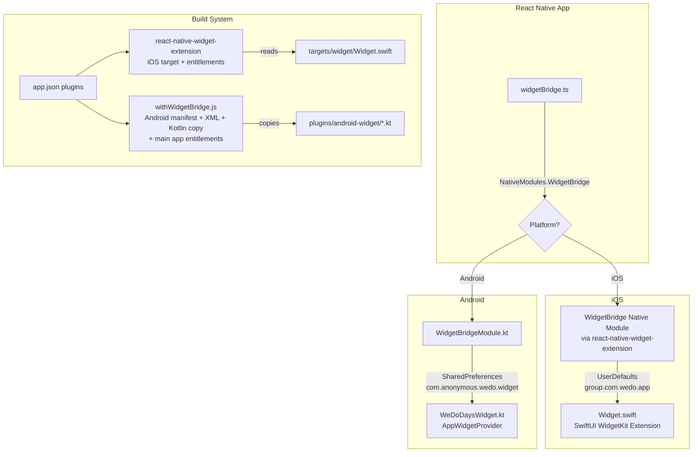

# Design Document: Native Home Widgets

## Overview

This design replaces the fragile 500-line custom Xcode target injection in `withWidgetBridge.js` with the `react-native-widget-extension` library for iOS, and adds the missing Android Kotlin file-copy step to the existing config plugin. The end result: `expo prebuild --clean` produces fully functional native projects on both platforms with "Days Together" home screen widgets.

The architecture keeps the existing JS-side `widgetBridge.ts` and Android `WidgetBridgeModule.kt` NativeModule largely unchanged. The iOS widget extension is a standalone SwiftUI WidgetKit target managed by `react-native-widget-extension`. The Android widget continues using `AppWidgetProvider` with `RemoteViews`.

### Key Design Decisions

1. **react-native-widget-extension over custom Xcode manipulation**: The library handles Xcode target creation, build phases, embed phases, and entitlements — all the things the current 500-line `withXcodeProject` block does manually and fragily. It reads SwiftUI source files from a `targets/widget/` directory.

2. **Keep withWidgetBridge.js for Android + main app entitlements**: The plugin still handles Android manifest registration, XML resource generation, Kotlin file copying, and the main app's App Group entitlement. Only the iOS Xcode target injection and iOS file-copy `withDangerousMod` are removed.

3. **Single Widget.swift file**: The iOS widget uses a single `Widget.swift` file containing the timeline provider, entry, and view. This is simpler than the current two-file approach (`WeDoDaysWidget.swift` + `WeDoDaysWidgetViews.swift`) and is the pattern `react-native-widget-extension` expects.

4. **Kotlin source files in `plugins/android-widget/`**: The three Kotlin files (`WeDoDaysWidget.kt`, `WidgetBridgeModule.kt`, `WidgetBridgePackage.kt`) live in the project root under `plugins/android-widget/` and are copied into the Android build directory during prebuild via `withDangerousMod`.

## Architecture



## Components and Interfaces

### 1. `react-native-widget-extension` Plugin (iOS)

**Responsibility**: Creates the WeDoDaysWidget extension target in the Xcode project during `expo prebuild`.

**Configuration in app.json**:
```json
[
  "react-native-widget-extension",
  {
    "widgetName": "WeDoDaysWidget",
    "targetName": "WeDoDaysWidget",
    "bundleIdentifier": "com.anonymous.wedo.WeDoDaysWidget",
    "widgetDir": "targets/widget",
    "appGroups": ["group.com.wedo.app"],
    "deploymentTarget": "16.0"
  }
]
```

The library handles:
- Adding the extension target to the Xcode project
- Configuring build settings (Swift version, deployment target, bundle ID)
- Copying SwiftUI source files from `targets/widget/` into the build
- Adding App Group entitlement to the extension target
- Embedding the `.appex` in the main app bundle

### 2. `withWidgetBridge.js` Config Plugin (Simplified)

**Responsibility**: After removing iOS Xcode manipulation, this plugin handles:

| Modifier | Platform | Purpose |
|---|---|---|
| `withEntitlementsPlist` | iOS | Adds `group.com.wedo.app` to main app entitlements |
| `withAndroidManifest` | Android | Registers `WeDoDaysWidget` receiver with `APPWIDGET_UPDATE` intent filter |
| `withDangerousMod` (android) | Android | Generates XML resources (`wedo_days_widget_info.xml`, `widget_days_together.xml`, strings) |
| `withDangerousMod` (android) | Android | Copies Kotlin files from `plugins/android-widget/` to `android/app/src/main/java/com/anonymous/wedo/` |

**Removed modifiers**:
- `withXcodeProject` — entire iOS target injection block (~300 lines)
- `withDangerousMod` for `ios` — widget file copy block

### 3. `targets/widget/Widget.swift` (iOS Widget Extension)

**Responsibility**: SwiftUI WidgetKit extension that displays the Days Together count.

**Interface**:
- Reads `startDate` (String, ISO format) from `UserDefaults(suiteName: "group.com.wedo.app")`
- Calculates days between `startDate` and current date
- Displays count or placeholder if no data
- Requests timeline refresh every 24 hours via `TimelineReloadPolicy.after(nextMidnight)`

**Structure**:
```
TimelineProvider → SimpleEntry(date, daysTogether, hasData)
                 → WeDoDaysWidgetEntryView (SwiftUI View)
                 → WeDoDaysWidget (@main Widget)
```

### 4. `plugins/android-widget/` Kotlin Files

Three files copied during prebuild:

| File | Role |
|---|---|
| `WeDoDaysWidget.kt` | `AppWidgetProvider` — reads SharedPreferences, calculates days, updates `RemoteViews` |
| `WidgetBridgeModule.kt` | React Native `NativeModule` — writes data to SharedPreferences, triggers widget refresh |
| `WidgetBridgePackage.kt` | `ReactPackage` — registers `WidgetBridgeModule` |

These are identical to the current files in `android/app/src/main/java/com/anonymous/wedo/` but sourced from `plugins/android-widget/` so they survive `expo prebuild --clean`.

### 5. `src/services/widgetBridge.ts` (Unchanged)

**Responsibility**: JS bridge that calls `NativeModules.WidgetBridge.setWidgetData(startDate, isPremium)`.

No changes needed. The existing implementation already:
- Fetches `start_date` from Supabase
- Writes to AsyncStorage as fallback
- Calls the native bridge
- Fails silently on error

## Data Models

### Shared Widget Data (Cross-Process)

Both platforms use the same logical data model for cross-process communication between the main app and the widget:

| Field | Type | Example | Storage Key |
|---|---|---|---|
| `startDate` | String (ISO date) | `"2024-01-15"` | `startDate` |
| `isPremium` | Boolean | `true` | `isPremium` |

**iOS Storage**: `UserDefaults(suiteName: "group.com.wedo.app")`
**Android Storage**: `SharedPreferences("com.anonymous.wedo.widget")`

### iOS Timeline Entry

```swift
struct SimpleEntry: TimelineEntry {
    let date: Date           // Timeline date (for WidgetKit scheduling)
    let daysTogether: Int    // Calculated days count (≥ 0)
    let hasData: Bool        // Whether a valid startDate was found
}
```

### Android Widget Layout Bindings

The `RemoteViews` layout (`widget_days_together.xml`) binds to:

| View ID | Content |
|---|---|
| `widget_heart` | Static "❤️" emoji |
| `widget_days_count` | Days count number or "❤️" placeholder |
| `widget_days_label` | "Days Together" or "Open WeDo to get started" |
| `widget_background` | Background color (premium: coral, default: dark) |

### Days Together Calculation

Both platforms use the same algorithm:

```
daysTogether = max(0, floor((currentDate - startDate) / oneDay))
```

- **iOS**: `Calendar.current.dateComponents([.day], from: startDate, to: Date()).day ?? 0`
- **Android**: `ChronoUnit.DAYS.between(startDate, LocalDate.now()).coerceAtLeast(0)`
- **JS**: `Math.max(0, Math.floor((now - start) / 86400000))`

### File Structure After Implementation

```
project-root/
├── targets/
│   └── widget/
│       └── Widget.swift                    # iOS SwiftUI widget (NEW)
├── plugins/
│   ├── android-widget/
│   │   ├── WeDoDaysWidget.kt              # Android widget provider (NEW - moved from android/)
│   │   ├── WidgetBridgeModule.kt          # Android native module (NEW - moved from android/)
│   │   └── WidgetBridgePackage.kt         # Android package registry (NEW - moved from android/)
│   └── withWidgetBridge.js                # Config plugin (MODIFIED - iOS code removed)
├── src/
│   └── services/
│       └── widgetBridge.ts                # JS bridge (UNCHANGED)
└── app.json                               # Plugin config (MODIFIED - add react-native-widget-extension)
```

## Correctness Properties

*A property is a characteristic or behavior that should hold true across all valid executions of a system — essentially, a formal statement about what the system should do. Properties serve as the bridge between human-readable specifications and machine-verifiable correctness guarantees.*

### Property 1: Days Together Calculation is Non-Negative and Monotonic

*For any* valid ISO date string `startDate` that is on or before the current date, `calculateDaysTogether(startDate)` should return a non-negative integer equal to the number of whole calendar days between `startDate` and today. *For any* `startDate` in the future, the result should be 0.

**Validates: Requirements 3.3, 5.2**

### Property 2: File Copy Produces Identical Output

*For any* set of source files in `plugins/android-widget/`, after the config plugin's copy operation runs, each destination file in `android/app/src/main/java/com/anonymous/wedo/` should have byte-identical content to its source file, regardless of whether the destination file previously existed.

**Validates: Requirements 4.1, 4.2, 4.3**

### Property 3: Widget Bridge Passes Data Through to Native Module

*For any* valid `startDate` string and `isPremium` boolean retrieved from Supabase, when `syncWidgetData` is called, the Widget Bridge should invoke `NativeModules.WidgetBridge.setWidgetData` with exactly those same `startDate` and `isPremium` values.

**Validates: Requirements 6.1**

### Property 4: Widget Bridge Fails Silently on Any Error

*For any* error thrown by the Supabase query, AsyncStorage write, or NativeModules bridge call, `syncWidgetData` should resolve without throwing an exception and should not crash the app.

**Validates: Requirements 6.5**

## Error Handling

### JS Widget Bridge (`widgetBridge.ts`)

| Error Source | Handling | Behavior |
|---|---|---|
| Supabase query fails | `catch` block | Returns silently, no widget update |
| No `relationshipId` in store | Early return | No-op |
| No `start_date` in response | Early return | No-op |
| `AsyncStorage.setItem` fails | `catch` block | Swallowed, continues to native bridge |
| `NativeModules.WidgetBridge` is null | Conditional check | Skips native call |
| `WidgetBridge.setWidgetData` rejects | `catch` block | Swallowed silently |

### iOS Widget Extension (`Widget.swift`)

| Error Source | Handling | Behavior |
|---|---|---|
| `UserDefaults` returns nil for `startDate` | `hasData = false` | Shows "Open WeDo" placeholder |
| Date parsing fails | `nil` coalescing | Shows placeholder |
| Negative day count | `max(0, ...)` | Clamps to 0 |

### Android Widget (`WeDoDaysWidget.kt`)

| Error Source | Handling | Behavior |
|---|---|---|
| SharedPreferences returns null for `startDate` | Null check | Shows "Open WeDo to get started" placeholder |
| `LocalDate.parse` throws | `try/catch` | Shows "Open WeDo to start" fallback |
| Negative day count | `.coerceAtLeast(0)` | Clamps to 0 |

### Config Plugin (`withWidgetBridge.js`)

| Error Source | Handling | Behavior |
|---|---|---|
| Source Kotlin file missing | `fs.existsSync` check | Skips copy (prebuild continues) |
| Destination directory missing | `fs.mkdirSync({ recursive: true })` | Creates directory tree |
| `strings.xml` missing | Creates new file | Writes minimal resources XML |
| `strings.xml` exists without widget_description | String replacement | Appends widget_description entry |

## Testing Strategy

### Property-Based Tests (fast-check)

The project already has `fast-check` as a devDependency. Each correctness property maps to a single property-based test with a minimum of 100 iterations.

**Library**: `fast-check` (already in `devDependencies`)
**Runner**: Jest or Vitest (whichever the project uses)
**Minimum iterations**: 100 per property test

| Test | Property | What it generates |
|---|---|---|
| `calculateDaysTogether` correctness | Property 1 | Random ISO date strings (past, today, future) |
| Config plugin file copy integrity | Property 2 | Random file content strings, pre-existing/missing destination scenarios |
| Widget bridge data passthrough | Property 3 | Random `startDate` strings + `isPremium` booleans |
| Widget bridge silent failure | Property 4 | Random error types thrown by mocked dependencies |

Each property test must be tagged with a comment:
```
// Feature: native-home-widgets, Property 1: Days Together Calculation is Non-Negative and Monotonic
```

### Unit Tests (Examples & Edge Cases)

| Test | Type | What it verifies |
|---|---|---|
| `calculateDaysTogether("2024-01-01")` with known date | Example | Specific expected output |
| `calculateDaysTogether` with today's date | Edge case | Returns 0 |
| `calculateDaysTogether` with future date | Edge case | Returns 0 (clamped) |
| `syncWidgetData` with no `relationshipId` | Edge case | Early return, no native call |
| `syncWidgetData` with null Supabase response | Edge case | Silent return |
| Config plugin: `strings.xml` already has `widget_description` | Edge case | No duplicate entry |
| Config plugin: destination file already exists | Edge case | Overwritten |

### Integration / Build Verification (Manual)

These are not automated but should be verified during development:

- `expo prebuild --clean` produces iOS project with WeDoDaysWidget target
- `expo prebuild --clean` produces Android project with all Kotlin files and XML resources
- iOS widget displays days count when `startDate` is in UserDefaults
- Android widget displays days count when `startDate` is in SharedPreferences
- Both widgets show placeholder when no data is available
