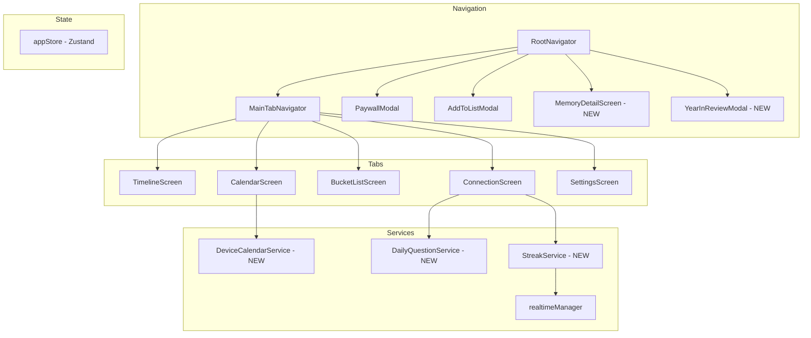

# Design Document: Premium Upgrade

## Overview

The Premium Upgrade feature enhances the WeDo couples app across five areas: Calendar, Timeline, Bucket List, Global UI, and Conversation Deck. This design builds on the existing React Native / Expo architecture with Supabase backend, Zustand state management, `react-native-reanimated` animations, and `react-native-calendars`.

The upgrade introduces: a month/year picker and infinite-scroll calendar, memory detail views with shared element transitions, an anniversary banner with year-in-review, a bucket list map view with location pins, skeleton shimmer loaders, Lottie micro-interactions, ambient mesh gradients, a daily question system, and a streak counter backed by Supabase.

## Architecture

The existing app follows a screen-centric architecture with:
- **Navigation**: `@react-navigation/native-stack` (RootNavigator) + `@react-navigation/bottom-tabs` (MainTabNavigator)
- **State**: Zustand store (`appStore.ts`) for auth, premium status, relationship metadata
- **Backend**: Supabase (Postgres + Realtime subscriptions via `realtimeManager.ts`)
- **Styling**: Mix of `StyleSheet` and NativeWind/Tailwind classes
- **Animations**: `react-native-reanimated` for enter/exit transitions

### New Dependencies

| Package | Purpose |
|---------|---------|
| `expo-calendar` | Native device calendar read/write (Req 3) |
| `react-native-maps` | Map view for bucket list pins (Req 7, 9) |
| `react-native-google-places-autocomplete` | Location search in AddToListModal (Req 8) |
| `lottie-react-native` | Celebratory micro-interactions (Req 11) |
| `expo-linear-gradient` | Skeleton shimmer + mesh gradient (Req 10, 12) |

### Architecture Diagram



## Components and Interfaces

### 1. Calendar Screen Enhancements

**MonthYearPicker** (new component)
- Bottom-sheet modal with scrollable month (Jan–Dec) and year picker wheels
- Props: `visible: boolean`, `currentMonth: string`, `onSelect: (month: number, year: number) => void`, `onDismiss: () => void`
- Uses `@gorhom/bottom-sheet` or a simple `Modal` with `ScrollView` pickers

**CalendarScreen changes**
- Replace `<Calendar />` with `<CalendarList />` from `react-native-calendars`, configured with `horizontal={true}`, `pagingEnabled={true}`
- Header month/year text becomes a `Pressable` that opens `MonthYearPicker`
- `CalendarList` `onVisibleMonthsChange` updates the header text
- Retain existing `dayComponent` renderer for stickers, notes, events

### 2. Timeline Enhancements

**MemoryDetailScreen** (new screen)
- Stack screen registered in `RootNavigator`
- Receives `memoryId` param, fetches or receives full `MemoryEntry` via route params
- Full-screen photo with `sharedTransitionTag`, caption below with slide-up animation, audio player if `audio_url` exists
- Back navigation preserves Timeline scroll position (handled by native stack)

**Shared Element Transitions**
- `MemoryCard` photo gets `sharedTransitionTag={`memory-photo-${item.id}`}`
- `MemoryDetailScreen` photo uses matching tag
- Caption uses `FadeInDown` entering animation
- Powered by `react-native-reanimated` shared transitions API

**AnniversaryBanner** (new component)
- Reads `relationshipStartDate` from `appStore`
- Computes if current date is within ±7 days of yearly anniversary
- Renders a glowing banner with pulsing animation at top of Timeline feed
- `onPress` opens `YearInReviewModal`

**YearInReviewModal** (new screen/modal)
- Instagram-Story-style paginated format using horizontal `FlatList` or `PagerView`
- Pages: total memories, total bucket list items completed, total calendar events (past year)
- Data fetched via Supabase aggregate queries on mount

### 3. Bucket List Enhancements

**SegmentedControl** (new component)
- Two-option toggle: "List" / "Map"
- Props: `selectedIndex: number`, `onChange: (index: number) => void`
- Defaults to index 0 ("List") on mount

**BucketListMapView** (new component)
- Uses `react-native-maps` `<MapView>` with custom markers
- Plots uncompleted items that have `latitude` and `longitude`
- Marker press opens `PinPreviewModal`

**PinPreviewModal** (new component)
- Shows bucket list item title and place name
- Dismiss returns to map at same position/zoom

**AddToListModal changes**
- Add `LocationSearch` component using `react-native-google-places-autocomplete`
- Stores `place_name`, `latitude`, `longitude` in form state
- Location is optional; persists to `bucket_list_items` table on save

**BucketListItem type extension**
```typescript
// Extend existing BucketListItem in realtimeManager.ts
export interface BucketListItem {
  id: string;
  relationship_id: string;
  title: string;
  url: string | null;
  completed: boolean;
  created_by: string;
  created_at: string;
  // New fields
  latitude: number | null;
  longitude: number | null;
  place_name: string | null;
}
```

### 4. Global UI Components

**SkeletonCard** (new component)
- Shimmer animation using `expo-linear-gradient` + `react-native-reanimated`
- Configurable shape (card, row, circle) via props
- Replaces text-based loading indicators on Timeline, Calendar, BucketList, Connection screens

**LottieOverlay** (new component)
- Wraps `lottie-react-native` `<LottieView>`
- Plays a neon checkmark + confetti animation once on bucket list item completion
- `pointerEvents="none"` so it doesn't block interaction
- Auto-removes from view hierarchy after `onAnimationFinish`

**MeshGradient** (new component)
- Animated gradient background using `expo-linear-gradient` + `react-native-reanimated`
- Slow-moving color transitions that loop continuously
- Applied to `SplashScreen` and `PaywallModal` backgrounds

### 5. Conversation Deck Streaks

**DailyQuestionService** (new service)
- Deterministic selection from `deep_questions.json` based on UTC date
- Algorithm: `index = daysSinceEpoch % totalQuestions` (cycles through all before repeating)
- Exports `getDailyQuestion(date: Date): Prompt`

**StreakService** (new service)
- Reads/writes `daily_streaks` table in Supabase
- `getStreak(relationshipId: string): Promise<StreakData>`
- `markDiscussed(relationshipId: string, userId: string): Promise<void>`
- Streak increments only when both partners have discussed on the same calendar day
- Streak resets to 0 if a day is missed

**StreakCounter** (new component)
- Displays 🔥 icon + current streak count
- Dimmed style when streak is 0, bright/active when > 0
- Subscribes to Supabase realtime on `daily_streaks` table for live updates

**ConnectionScreen changes**
- Add `StreakCounter` at top of screen
- Add `DailyQuestionCard` (visually distinct) above the swipeable deck
- Daily question updates at midnight UTC

### 6. DeviceCalendarService (new service)

- Uses `expo-calendar` to request permissions, read calendars, create events
- `requestPermissions(): Promise<boolean>`
- `syncEventToDevice(event: { title, date, time }): Promise<{ success: boolean, error?: string }>`
- Called from `AddEventModal` when sync toggle is enabled and user saves

**AddEventModal changes**
- Add "Sync to Device Calendar" toggle (hidden for non-premium users)
- On save with toggle enabled: request permissions if needed, then sync
- Handle permission denial and sync failure gracefully

## Data Models

### Existing Tables (modified)

**bucket_list_items** — add columns:
| Column | Type | Default | Description |
|--------|------|---------|-------------|
| `latitude` | `float8` | `null` | GPS latitude from Google Places |
| `longitude` | `float8` | `null` | GPS longitude from Google Places |
| `place_name` | `text` | `null` | Human-readable place name |

### New Tables

**daily_streaks**
| Column | Type | Constraints | Description |
|--------|------|-------------|-------------|
| `id` | `uuid` | PK, default `gen_random_uuid()` | Row ID |
| `relationship_id` | `uuid` | FK → relationships, UNIQUE | One row per relationship |
| `current_streak` | `integer` | NOT NULL, default 0 | Consecutive days both partners discussed |
| `last_completed_date` | `date` | nullable | Last date both partners completed |
| `user1_completed_today` | `boolean` | NOT NULL, default false | Whether first partner discussed today |
| `user2_completed_today` | `boolean` | NOT NULL, default false | Whether second partner discussed today |
| `updated_at` | `timestamptz` | NOT NULL, default `now()` | Last update timestamp |

**Streak Logic:**
1. When a user marks the daily question as discussed, set their `userX_completed_today = true`
2. If both `user1_completed_today` and `user2_completed_today` are true AND `last_completed_date != today`:
   - If `last_completed_date == yesterday`: increment `current_streak`
   - Else: set `current_streak = 1`
   - Set `last_completed_date = today`
3. A scheduled job or client-side check resets `user1_completed_today` and `user2_completed_today` to false at midnight UTC
4. If `last_completed_date < yesterday` on next access: reset `current_streak = 0`

### Navigation Types Update

```typescript
export type RootStackParamList = {
  OnboardingStack: undefined;
  MainTabNavigator: undefined;
  PaywallModal: undefined;
  AddToListModal: { url?: string } | undefined;
  WheelScreen: undefined;
  // New
  MemoryDetailScreen: { memory: MemoryEntry };
  YearInReviewModal: undefined;
};
```


## Correctness Properties

*A property is a characteristic or behavior that should hold true across all valid executions of a system — essentially, a formal statement about what the system should do. Properties serve as the bridge between human-readable specifications and machine-verifiable correctness guarantees.*

### Property 1: Month/Year Picker Navigation

*For any* valid month (1–12) and year combination, when the user confirms a selection in the MonthYearPicker, the CalendarScreen's displayed month should equal the selected month and year.

**Validates: Requirements 1.3**

### Property 2: Month/Year Picker Dismiss Preserves State

*For any* current month displayed on the CalendarScreen, dismissing the MonthYearPicker without confirming should leave the displayed month unchanged.

**Validates: Requirements 1.4**

### Property 3: Swipe Navigation Direction

*For any* current month on the CalendarList, swiping left should advance to the next month and swiping right should go to the previous month. Specifically, if the current month is M, swipe-left yields M+1 and swipe-right yields M-1 (wrapping at year boundaries).

**Validates: Requirements 2.2, 2.3**

### Property 4: Premium Gate for Device Calendar Sync Toggle

*For any* premium status value (true or false), the "Sync to Device Calendar" toggle in AddEventModal should be visible if and only if the user is a premium subscriber.

**Validates: Requirements 3.6**

### Property 5: Device Calendar Sync Round Trip

*For any* calendar event with a title, date, and optional time, when the user saves with sync enabled and permissions granted, reading the native device calendar should return an event matching the saved title and date.

**Validates: Requirements 3.3**

### Property 6: Memory Detail Displays All Fields

*For any* MemoryEntry, navigating to MemoryDetailScreen should render the entry's photo URL, caption, timestamp, and audio player (if `audio_url` is non-null). The rendered content should contain all non-null fields of the source entry.

**Validates: Requirements 4.2**

### Property 7: Shared Transition Tag Consistency

*For any* memory ID, the `sharedTransitionTag` on the MemoryCard photo should equal the `sharedTransitionTag` on the corresponding MemoryDetailScreen photo element. Specifically, both should equal `memory-photo-${memoryId}`.

**Validates: Requirements 5.1**

### Property 8: Anniversary Window Calculation

*For any* relationship start date and any current date, the anniversary banner should be visible if and only if the current date is within 7 days (inclusive, before or after) of the yearly anniversary of the start date.

**Validates: Requirements 6.2, 6.5**

### Property 9: Year-in-Review Statistics Accuracy

*For any* set of memories, bucket list items, and calendar events for a relationship over the past year, the Year_In_Review_Modal should display counts that match the actual totals from the data set.

**Validates: Requirements 6.4**

### Property 10: Segment View Switching

*For any* selected segment index (0 for "List", 1 for "Map"), the BucketListScreen should display the FlatList view when index is 0 and the MapView when index is 1.

**Validates: Requirements 7.2, 7.3**

### Property 11: Location Data Persistence Round Trip

*For any* bucket list item with optional location data (place_name, latitude, longitude), saving the item and then fetching it from Supabase should return the same location fields. Items saved without location should have null for all three location fields.

**Validates: Requirements 8.3, 8.4**

### Property 12: Location Selection Stores All Fields

*For any* place selected from the Google Places Autocomplete results, the form state should contain the place name, latitude, and longitude — all three must be non-null.

**Validates: Requirements 8.2**

### Property 13: Map Pin Visibility

*For any* set of bucket list items, the Map_View should display a pin for an item if and only if the item is not completed AND has non-null latitude and longitude values.

**Validates: Requirements 9.1, 9.2**

### Property 14: Skeleton-to-Content Transition

*For any* screen (Timeline, Calendar, BucketList, Connection), when the loading state transitions from true to false, the SkeletonCard components should be replaced by actual content components.

**Validates: Requirements 10.3**

### Property 15: Daily Question Determinism

*For any* date, calling `getDailyQuestion(date)` multiple times should always return the same prompt. Additionally, over any consecutive N days (where N equals the total number of prompts), every prompt should appear exactly once.

**Validates: Requirements 13.1, 13.4**

### Property 16: Streak Increment on Both Partners Completing

*For any* streak state where both partners mark the daily question as discussed on the same calendar day, the `current_streak` should increment by exactly 1 and `last_completed_date` should update to the current date.

**Validates: Requirements 14.2**

### Property 17: Streak Reset on Missed Day

*For any* streak state where a calendar day passes without both partners discussing the daily question, the `current_streak` should reset to 0.

**Validates: Requirements 14.3**

### Property 18: Streak Increment Idempotence

*For any* relationship on a given calendar day, completing the daily question multiple times (by either or both partners) should increment the streak at most once. Formally: `incrementStreak(incrementStreak(state)) == incrementStreak(state)` for the same calendar day.

**Validates: Requirements 14.4**

### Property 19: Streak Counter Visual Style

*For any* streak count value, the StreakCounter component should render with a dimmed style when the count is 0 and a bright/active style when the count is greater than 0.

**Validates: Requirements 15.2, 15.3**

## Error Handling

### Calendar Sync Errors
- **Permission denied**: Show informational message, save event to Supabase only (no crash, no data loss)
- **Native calendar write failure**: Save event to Supabase, show error toast indicating device sync failed
- **No default calendar found**: Fall back to first available calendar, or show error if none exist

### Location Search Errors
- **Google Places API failure**: Show inline error in LocationSearch, allow saving without location
- **Network timeout**: Show retry option, location field remains optional

### Streak Service Errors
- **Supabase write failure on streak update**: Retry with exponential backoff (max 3 attempts), show subtle error indicator
- **Realtime subscription disconnect**: Use existing `realtimeManager` reconnection logic with reconciliation
- **Race condition (both partners complete simultaneously)**: Use Supabase RPC/transaction to ensure atomic streak increment

### Map View Errors
- **react-native-maps load failure**: Show fallback message in map container, keep list view functional
- **Invalid coordinates in data**: Filter out items with invalid lat/lng before plotting

### General Patterns
- All Supabase mutations use optimistic updates with rollback on failure (existing pattern)
- Loading states use SkeletonCard instead of text indicators
- Network errors surface user-friendly messages via the existing error display patterns

## Testing Strategy

### Unit Tests
Unit tests cover specific examples, edge cases, and integration points:

- **MonthYearPicker**: Renders 12 months, confirm/dismiss callbacks fire correctly
- **Anniversary window**: Edge cases — exactly 7 days before, exactly 7 days after, day of anniversary, leap year anniversaries
- **Daily question**: Specific date → specific prompt mapping, epoch boundary
- **Streak logic**: Edge cases — first day ever, streak of 1, reset after gap of multiple days, both partners complete in different timezones
- **SegmentedControl**: Default selection is "List" on mount
- **SkeletonCard**: Renders shimmer gradient, accepts shape props
- **Map pin filtering**: Empty list, all completed, none with coordinates
- **DeviceCalendarService**: Permission request flow, error handling paths

### Property-Based Tests
Property-based tests verify universal properties across randomized inputs. Each property test references its design document property.

- **Library**: `fast-check` (JavaScript/TypeScript property-based testing library)
- **Minimum iterations**: 100 per property test
- **Tag format**: `Feature: premium-upgrade, Property {N}: {title}`

Each correctness property (1–19) maps to a single property-based test:

1. `Feature: premium-upgrade, Property 1: Month/Year Picker Navigation`
2. `Feature: premium-upgrade, Property 2: Month/Year Picker Dismiss Preserves State`
3. `Feature: premium-upgrade, Property 3: Swipe Navigation Direction`
4. `Feature: premium-upgrade, Property 4: Premium Gate for Device Calendar Sync Toggle`
5. `Feature: premium-upgrade, Property 5: Device Calendar Sync Round Trip`
6. `Feature: premium-upgrade, Property 6: Memory Detail Displays All Fields`
7. `Feature: premium-upgrade, Property 7: Shared Transition Tag Consistency`
8. `Feature: premium-upgrade, Property 8: Anniversary Window Calculation`
9. `Feature: premium-upgrade, Property 9: Year-in-Review Statistics Accuracy`
10. `Feature: premium-upgrade, Property 10: Segment View Switching`
11. `Feature: premium-upgrade, Property 11: Location Data Persistence Round Trip`
12. `Feature: premium-upgrade, Property 12: Location Selection Stores All Fields`
13. `Feature: premium-upgrade, Property 13: Map Pin Visibility`
14. `Feature: premium-upgrade, Property 14: Skeleton-to-Content Transition`
15. `Feature: premium-upgrade, Property 15: Daily Question Determinism`
16. `Feature: premium-upgrade, Property 16: Streak Increment on Both Partners Completing`
17. `Feature: premium-upgrade, Property 17: Streak Reset on Missed Day`
18. `Feature: premium-upgrade, Property 18: Streak Increment Idempotence`
19. `Feature: premium-upgrade, Property 19: Streak Counter Visual Style`

Properties 5, 6, 11, and 14 require mocking Supabase/native modules. Properties 8, 15, 16, 17, 18, and 19 are pure logic and can be tested without mocks. Property 13 tests a filtering function directly.
