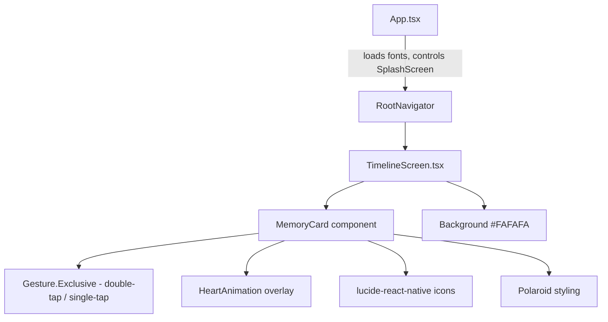

# Design Document: Viral Aesthetic Micro-Interactions

## Overview

This design transforms the WeDo Timeline screen from a dark-themed card layout into a warm "Digital Scrapbook" aesthetic. The overhaul covers five areas:

1. **Custom font loading** — Playfair Display (bold) + Nunito (regular, semi-bold) loaded via `expo-font` with `SplashScreen` coordination in `App.tsx`.
2. **Polaroid card styling** — Square photos, cream border, random tilt (-3° to 3°), drop shadows, and curated typography on `MemoryCard`.
3. **Double-tap like interaction** — Gesture-handler exclusive composition (double-tap priority over single-tap), heart spring animation via Reanimated, haptic feedback via `expo-haptics`, and Supabase like recording.
4. **SVG icon replacement** — `lucide-react-native` icons (Heart, Trash2, Mic) replacing emoji text.
5. **Timeline background update** — Warm cream `#FAFAFA` background with contrasting date headers.

The current `TimelineScreen.tsx` uses a dark `#121212` background, `BlurView` glass-morphism cards, emoji icons, and a simple `Pressable` for navigation. This redesign replaces those patterns while preserving existing functionality (delete, audio, scratch-off overlay, realtime updates).

## Architecture

The changes are scoped to two files and one new dependency:



**Key architectural decisions:**

- **Font loading in App.tsx**: Follows Expo's recommended pattern — `SplashScreen.preventAutoHideAsync()` at module scope, `useFonts` hook, then `SplashScreen.hideAsync()` on completion. This is the single entry point, so all screens benefit.
- **Gesture composition via `react-native-gesture-handler`**: Using `Gesture.Exclusive(doubleTap, singleTap)` ensures double-tap takes priority. The existing `Pressable` for navigation is replaced with gesture-handler taps.
- **Heart animation via `react-native-reanimated`**: Spring-based `useSharedValue` + `useAnimatedStyle` for scale (0 → 1.5) and opacity (1 → 0). No Lottie needed — keeps bundle small.
- **Random tilt stored as `useMemo`**: Each `MemoryCard` instance computes a random rotation once on mount, ensuring it stays stable across re-renders but varies per card.
- **No new screens or navigation changes**: All modifications are within existing components.

## Components and Interfaces

### 1. App.tsx — Font Loading

```typescript
// New imports
import { useFonts, PlayfairDisplay_700Bold } from '@expo-google-fonts/playfair-display';
import { Nunito_400Regular, Nunito_600SemiBold } from '@expo-google-fonts/nunito';
import * as SplashScreen from 'expo-splash-screen';

SplashScreen.preventAutoHideAsync();

export default function App() {
  const [fontsLoaded, fontError] = useFonts({
    PlayfairDisplay_700Bold,
    Nunito_400Regular,
    Nunito_600SemiBold,
  });

  useEffect(() => {
    if (fontsLoaded || fontError) {
      SplashScreen.hideAsync();
    }
  }, [fontsLoaded, fontError]);

  if (!fontsLoaded && !fontError) return null;

  // ... existing NavigationContainer render
}
```

### 2. MemoryCard — Polaroid Styling + Gestures + Heart Animation

**Props interface** (unchanged from current, plus new `onLike`):

```typescript
interface MemoryCardProps {
  item: MemoryEntry;
  onDelete: (id: string) => void;
  onLike: (id: string) => void;
}
```

**Tilt generation:**

```typescript
function generateTilt(): number {
  return (Math.random() * 6) - 3; // range [-3, 3]
}
```

**Gesture setup:**

```typescript
const doubleTap = Gesture.Tap()
  .numberOfTaps(2)
  .onEnd(() => {
    runOnJS(handleDoubleTap)();
  });

const singleTap = Gesture.Tap()
  .numberOfTaps(1)
  .onEnd(() => {
    runOnJS(handleSingleTap)();
  });

const composedGesture = Gesture.Exclusive(doubleTap, singleTap);
```

**Heart animation shared values:**

```typescript
const heartScale = useSharedValue(0);
const heartOpacity = useSharedValue(0);

function triggerHeartAnimation() {
  heartScale.value = 0;
  heartOpacity.value = 1;
  heartScale.value = withSpring(1.5, { damping: 6, stiffness: 120 });
  heartOpacity.value = withDelay(400, withTiming(0, { duration: 300 }));
}
```

### 3. SVG Icons

```typescript
import { Heart, Trash2, Mic } from 'lucide-react-native';

// Usage:
<Heart size={20} color="#E74C3C" />
<Trash2 size={16} color="#FFFFFF" />
<Mic size={16} color="#FF7F50" />
```

### 4. Timeline Background + Date Headers

```typescript
const styles = StyleSheet.create({
  container: {
    flex: 1,
    backgroundColor: '#FAFAFA',
  },
  dateHeader: {
    fontFamily: 'PlayfairDisplay_700Bold',
    fontSize: 16,
    color: '#4A4A4A',
  },
  caption: {
    fontFamily: 'PlayfairDisplay_700Bold',
  },
  timestamp: {
    fontFamily: 'Nunito_400Regular',
    color: '#8B8B8B',
  },
});
```

## Data Models

### Like Record (Supabase)

The double-tap like action writes to a `memory_likes` table (or equivalent) in Supabase:

```typescript
interface MemoryLike {
  id: string;           // UUID, primary key
  memory_id: string;    // FK to memories.id
  user_id: string;      // FK to auth.users.id
  created_at: string;   // ISO timestamp
}
```

The like is recorded via:
```typescript
await supabase.from('memory_likes').upsert({
  memory_id: item.id,
  user_id: currentUserId,
});
```

### Tilt Value

Not persisted — computed per card instance via `useMemo(() => generateTilt(), [])`. This is a pure UI concern.

### Font Names (Constants)

```typescript
const FONTS = {
  heading: 'PlayfairDisplay_700Bold',
  body: 'Nunito_400Regular',
  bodySemiBold: 'Nunito_600SemiBold',
} as const;
```


## Correctness Properties

*A property is a characteristic or behavior that should hold true across all valid executions of a system — essentially, a formal statement about what the system should do. Properties serve as the bridge between human-readable specifications and machine-verifiable correctness guarantees.*

### Property 1: Tilt rotation is bounded

*For any* generated tilt value from `generateTilt()`, the result must be within the inclusive range [-3, 3].

**Validates: Requirements 2.3**

### Property 2: Heart animation targets correct values

*For any* invocation of `triggerHeartAnimation()`, the scale shared value must target 1.5 and the opacity shared value must end at 0.

**Validates: Requirements 3.2**

## Error Handling

| Scenario | Handling |
|---|---|
| Font loading fails (`fontError` is truthy) | Hide splash screen, render app with system fallback fonts. No crash. |
| Supabase like upsert fails | Silently fail — the heart animation still plays (optimistic UI). Log error for debugging. |
| `lucide-react-native` icon fails to render | React Native will show an error boundary or empty space. No special handling needed — this would be a build-time issue. |
| Double-tap on a card that's already liked | Upsert is idempotent — no duplicate rows. Animation replays (acceptable UX). |

## Testing Strategy

### Unit Tests (Jest + React Native Testing Library)

Unit tests cover specific examples, edge cases, and integration points:

- **Font loading coordination**: Verify `SplashScreen.hideAsync()` is called when fonts load or fail. Verify app returns null while loading. (Validates 1.1, 1.2, 1.3, 1.4)
- **Polaroid card styles**: Verify photo has `aspectRatio: 1`, background is `#FAFAFA`, shadow styles are present, caption uses `PlayfairDisplay_700Bold`, timestamp uses `Nunito_400Regular`. (Validates 2.1, 2.2, 2.4, 2.5, 2.6)
- **Gesture interactions**: Verify double-tap triggers haptic feedback and Supabase like upsert. Verify single-tap navigates to `MemoryDetailScreen`. Verify `Gesture.Exclusive` is used with double-tap first. (Validates 3.1, 3.3, 3.4, 3.5, 3.6)
- **SVG icon rendering**: Verify Heart, Trash2, and Mic icons from `lucide-react-native` are rendered in the card. (Validates 4.1, 4.2, 4.3)
- **Timeline background**: Verify container background is `#FAFAFA`, date header uses `PlayfairDisplay_700Bold` with a contrasting color. (Validates 5.1, 5.2, 5.3)

### Property-Based Tests (fast-check)

The project already has `fast-check` in devDependencies. Each property test runs a minimum of 100 iterations.

- **Property 1 test**: Generate thousands of tilt values via `generateTilt()` and assert each is in [-3, 3].
  - Tag: `Feature: viral-aesthetic-micro-interactions, Property 1: Tilt rotation is bounded`
- **Property 2 test**: For any trigger of the heart animation function, assert the scale target is 1.5 and opacity target is 0.
  - Tag: `Feature: viral-aesthetic-micro-interactions, Property 2: Heart animation targets correct values`

Each correctness property is implemented by a single property-based test. Property tests complement unit tests — unit tests verify specific scenarios while property tests verify invariants hold across all inputs.
