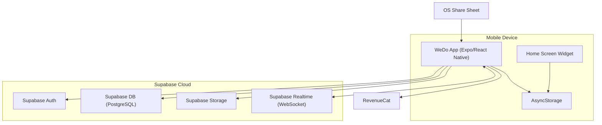
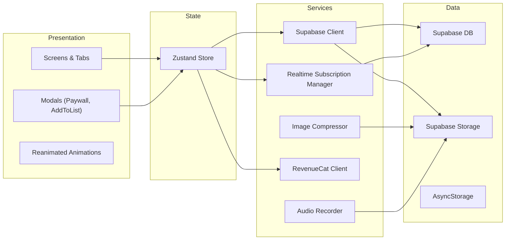
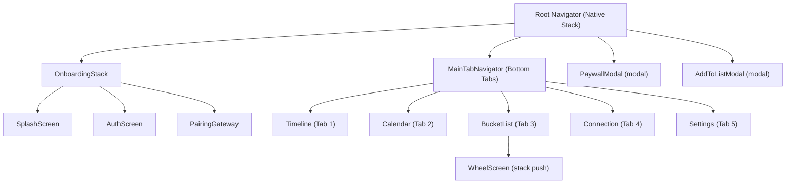
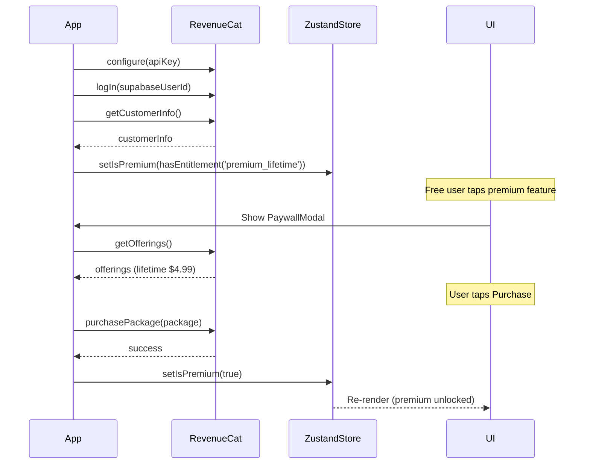
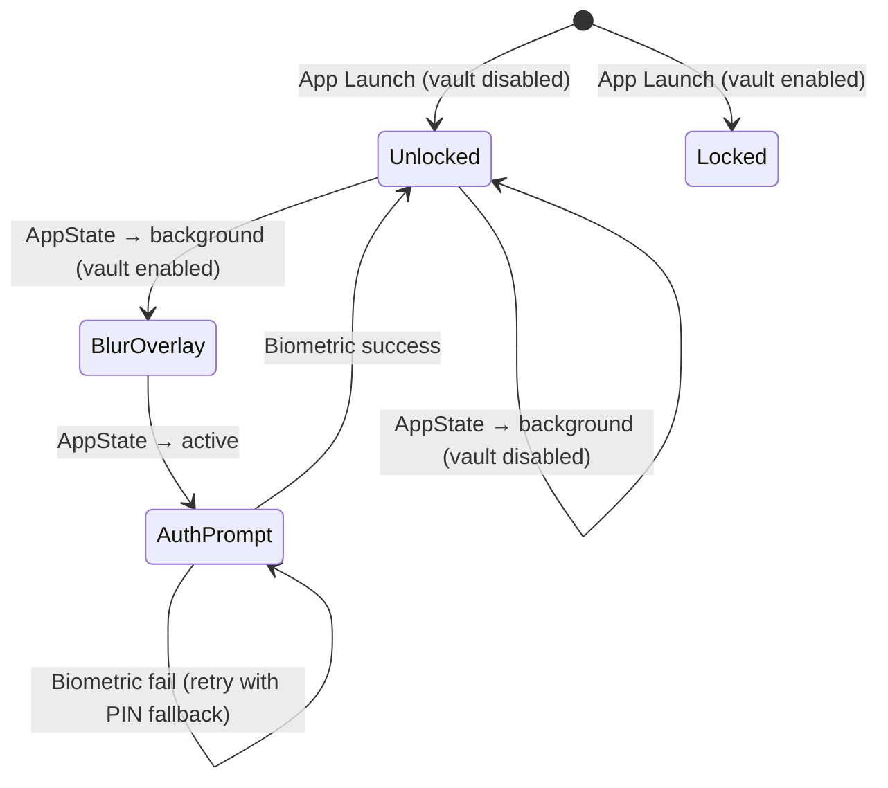

# Design Document — WeDo: The Adventure Log

## Overview

WeDo is a couples-only mobile app built with React Native (Expo) that helps partners track, celebrate, and deepen their relationship through shared digital experiences. The app is organized around five main tabs (Timeline, Calendar, Bucket List, Connection, Settings) and includes premium features gated by a $4.99 lifetime unlock via RevenueCat.

The architecture follows a "Scalable Startup" philosophy: maximize on-device processing, use hardcoded assets where possible, and keep Supabase cloud costs near $0 through aggressive image compression and minimal remote data.

### Key Design Decisions

- **Supabase as sole backend**: Auth, Database (PostgreSQL), Storage, and Realtime WebSockets — eliminates the need for a custom server.
- **Zustand for state**: Lightweight, minimal boilerplate, perfect for a small team. Stores auth state, premium entitlement, and ephemeral UI state.
- **On-device image compression**: All photos are resized and compressed via `expo-image-manipulator` before upload, targeting ≤200KB per image.
- **Hardcoded conversation prompts**: 300+ prompts stored in a local JSON file — zero backend cost for the Conversation Deck feature.
- **RevenueCat for IAP**: Handles purchase verification, entitlement management, and restore logic across iOS and Android.
- **Native widgets**: iOS uses SwiftUI/WidgetKit, Android uses native widget APIs — both read from local storage to avoid network calls.

### System Context Diagram



## Architecture

### High-Level Architecture

The app follows a layered architecture:

1. **Presentation Layer** — React Native screens, components, animations (react-native-reanimated, react-native-gesture-handler)
2. **State Layer** — Zustand stores managing auth, premium status, real-time subscriptions, and UI state
3. **Service Layer** — Modules for image compression, audio recording, Supabase client, RevenueCat client
4. **Data Layer** — Supabase (PostgreSQL + Storage + Realtime), AsyncStorage for local caching
5. **Native Layer** — iOS SwiftUI widgets, Android native widgets, Expo Config Plugins for intent filters



### Data Flow

1. **Write path**: User action → Zustand dispatch → Service call → Supabase DB/Storage write → Realtime broadcast → Partner's Zustand store → Partner's UI update
2. **Read path**: Screen mount → Zustand selector → Supabase query (if cache miss) → Render
3. **Widget path**: App foreground → Write relationship start date to AsyncStorage → Widget reads AsyncStorage → Renders "X Days Together"
4. **Share Sheet path**: External app share → OS intent filter → App deep link handler → AddToListModal with pre-populated URL

### Navigation Structure



**Navigator Configuration:**
- `Root_Navigator`: `createNativeStackNavigator()` — contains `OnboardingStack`, `MainTabNavigator`, and two modal screens (`PaywallModal`, `AddToListModal`) with `presentation: 'modal'`
- `OnboardingStack`: `createNativeStackNavigator()` — `SplashScreen` → `AuthScreen` → `PairingGateway`
- `MainTabNavigator`: `createBottomTabNavigator()` — 5 tabs with outlined icons, active tab highlighted in Soft Coral (#FF7F50), inactive in muted gray
- `WheelScreen`: Pushed onto the Root stack from the Bucket List tab header icon
- After pairing completes, `Root_Navigator` replaces `OnboardingStack` with `MainTabNavigator` (no back navigation to onboarding)
- Default initial tab: Timeline (Tab 1)

## Components and Interfaces

### Screen Components

#### OnboardingStack
- **SplashScreen** — Animated logo, auto-navigates to AuthScreen
- **AuthScreen** — Apple/Google OAuth buttons, Magic Link email input. Calls `supabase.auth.signInWithOAuth()` or `supabase.auth.signInWithOtp()`
- **PairingGateway** — Two-button choice: "Start New Adventure" (generates 6-digit code) / "Join Partner" (code input field). On success: confetti animation via `react-native-reanimated`, haptic feedback via `expo-haptics`, navigate to MainTabNavigator

#### MainTabNavigator Screens
- **TimelineScreen (Tab 1)** — `FlatList` rendering `MemoryCard` components in reverse-chronological order. Empty state with illustration. Pull-to-refresh. Real-time subscription active.
- **CalendarScreen (Tab 2)** — `react-native-calendars` `Calendar` component in full-screen. `StickerDrawer` bottom sheet. Horizontal month swiping.
- **BucketListScreen (Tab 3)** — `FlatList` of `BucketListItem` components. FAB "+" button. Header icon for Indecision Wheel. Real-time subscription active.
- **ConnectionScreen (Tab 4)** — `ConversationDeck` card stack. Fisher-Yates shuffle on load. Free users see 1 preview + locked card.
- **SettingsScreen (Tab 5)** — Scrollable list: Profile, Partner Info, Privacy Vault toggle, Theme selector, Subscription management (Restore Purchases), Widget instructions.

#### Modal Screens
- **PaywallModal** — Full-screen slide-up. Product info, price ($4.99 lifetime), purchase button, restore link. Calls `Purchases.purchasePackage()`.
- **AddToListModal** — Full-screen slide-up. Title input, optional URL field (pre-populated by Social Catcher). Submit/Cancel buttons.

#### Overlay Components
- **PrivacyVaultOverlay** — Full-screen `BlurView` (expo-blur) with biometric prompt. Listens to `AppState` changes. Controlled by Zustand `isVaultLocked` state.

### Shared Components

- **MemoryCard** — Glassmorphism card displaying photo, caption, timestamp, scratch-off overlay (if unrevealed for partner), audio waveform (if attached). Uses `react-native-reanimated` for spring entrance animation.
- **ScratchOffOverlay** — Canvas-based touch eraser using `react-native-gesture-handler` `PanGestureHandler`. Tracks erased percentage. Auto-completes at 60%. Haptic feedback on touch-move.
- **AudioPlayer** — Waveform visualization + play/pause button. Uses `expo-av` `Audio.Sound`.
- **AudioRecorder** — Recording UI with live duration counter and stop button. Max 60s. Uses `expo-av` `Audio.Recording`.
- **StickerDrawer** — Bottom sheet with two tabs: "Default" (20 stickers) and "Custom Photo" (premium only). Stickers are draggable via `react-native-gesture-handler`.
- **IndecisionWheel** — Physics-based spinning wheel rendered with `react-native-reanimated`. Deceleration curve animation. Haptic on land.
- **ConversationCard** — Flip/swipe card with prompt text. Built with `react-native-reanimated` shared transitions.
- **BucketListItem** — Row component with title, optional URL link, completion checkbox. Swipe-to-complete gesture.

### Service Interfaces

```typescript
// Image Compression Service
interface ImageCompressor {
  compress(uri: string): Promise<{ uri: string; size: number }>;
  // Resizes longest dimension to 1200px, JPEG quality 0.7
  // Iteratively lowers quality (0.1 steps) to 0.3 if >200KB
  // Rejects if still >200KB at quality 0.3
}

// Audio Recording Service
interface AudioRecorderService {
  startRecording(): Promise<void>;
  stopRecording(): Promise<{ uri: string; duration: number }>;
  uploadAudio(localUri: string, entryId: string, relationshipId: string): Promise<string>;
  // Records .m4a (MPEG4 AAC), max 60s auto-stop
}

// Realtime Subscription Manager
interface RealtimeManager {
  subscribeToMemories(relationshipId: string, onInsert: (entry: MemoryEntry) => void, onUpdate: (entry: MemoryEntry) => void): RealtimeChannel;
  subscribeToStickers(relationshipId: string, onInsert: (sticker: CalendarSticker) => void): RealtimeChannel;
  subscribeToBucketList(relationshipId: string, onInsert: (item: BucketListItem) => void, onUpdate: (item: BucketListItem) => void): RealtimeChannel;
  unsubscribeAll(): void;
}

// RevenueCat Service
interface PurchaseService {
  checkEntitlement(): Promise<boolean>;
  purchase(): Promise<boolean>;
  restore(): Promise<boolean>;
}
```

## Data Models

### Supabase Database Schema

#### `users` Table
| Column | Type | Constraints | Description |
|--------|------|-------------|-------------|
| id | UUID | PK, default `auth.uid()` | Supabase Auth user ID |
| email | TEXT | NOT NULL | User email |
| display_name | TEXT | | User display name |
| avatar_url | TEXT | | Profile photo URL |
| relationship_id | UUID | FK → relationships.id, NULLABLE | Linked relationship |
| created_at | TIMESTAMPTZ | default `now()` | Account creation time |

#### `relationships` Table
| Column | Type | Constraints | Description |
|--------|------|-------------|-------------|
| id | UUID | PK, default `gen_random_uuid()` | Relationship ID |
| user1_id | UUID | FK → users.id, NOT NULL | First partner |
| user2_id | UUID | FK → users.id, NOT NULL | Second partner |
| start_date | DATE | NOT NULL, default `CURRENT_DATE` | Relationship start date (for widget counter) |
| created_at | TIMESTAMPTZ | default `now()` | Pairing timestamp |

#### `pairing_codes` Table
| Column | Type | Constraints | Description |
|--------|------|-------------|-------------|
| id | UUID | PK, default `gen_random_uuid()` | |
| code | VARCHAR(6) | UNIQUE, NOT NULL | 6-digit alphanumeric code |
| created_by | UUID | FK → users.id, NOT NULL | User who generated the code |
| expires_at | TIMESTAMPTZ | NOT NULL | Expiration (e.g., 15 minutes) |
| used | BOOLEAN | default `false` | Whether code has been redeemed |
| created_at | TIMESTAMPTZ | default `now()` | |

#### `memories` Table
| Column | Type | Constraints | Description |
|--------|------|-------------|-------------|
| id | UUID | PK, default `gen_random_uuid()` | Memory entry ID |
| relationship_id | UUID | FK → relationships.id, NOT NULL | Owning relationship |
| created_by | UUID | FK → users.id, NOT NULL | User who created the memory |
| photo_url | TEXT | NOT NULL | Supabase Storage URL |
| caption | TEXT | NOT NULL, CHECK(length 1–500) | Memory caption |
| revealed | BOOLEAN | default `false` | Scratch-off state |
| audio_url | TEXT | NULLABLE | Audio note Storage URL |
| created_at | TIMESTAMPTZ | default `now()` | Server-generated timestamp |

#### `bucket_list_items` Table
| Column | Type | Constraints | Description |
|--------|------|-------------|-------------|
| id | UUID | PK, default `gen_random_uuid()` | |
| relationship_id | UUID | FK → relationships.id, NOT NULL | Owning relationship |
| title | TEXT | NOT NULL | Item title |
| url | TEXT | NULLABLE | Captured URL from Social Catcher |
| completed | BOOLEAN | default `false` | Completion state |
| created_by | UUID | FK → users.id, NOT NULL | |
| created_at | TIMESTAMPTZ | default `now()` | |

#### `calendar_stickers` Table
| Column | Type | Constraints | Description |
|--------|------|-------------|-------------|
| id | UUID | PK, default `gen_random_uuid()` | |
| relationship_id | UUID | FK → relationships.id, NOT NULL | Owning relationship |
| sticker_id | TEXT | NOT NULL | Default sticker key or custom sticker UUID |
| day | DATE | NOT NULL | Calendar day |
| x_coordinate | FLOAT | NOT NULL | X position within day cell |
| y_coordinate | FLOAT | NOT NULL | Y position within day cell |
| placed_by | UUID | FK → users.id, NOT NULL | |
| is_custom | BOOLEAN | default `false` | Whether this is a custom photo sticker |
| created_at | TIMESTAMPTZ | default `now()` | |

#### `custom_stickers` Table
| Column | Type | Constraints | Description |
|--------|------|-------------|-------------|
| id | UUID | PK, default `gen_random_uuid()` | |
| relationship_id | UUID | FK → relationships.id, NOT NULL | |
| image_url | TEXT | NOT NULL | Supabase Storage URL |
| created_by | UUID | FK → users.id, NOT NULL | |
| created_at | TIMESTAMPTZ | default `now()` | |

### Supabase Storage Bucket Structure

Single bucket: `wedo-assets`

```
wedo-assets/
├── {relationship_id}/
│   ├── memories/
│   │   └── {entry_id}.jpg          # Compressed memory photos
│   ├── audio/
│   │   └── {entry_id}.m4a          # Audio notes
│   └── stickers/
│       └── {sticker_id}.jpg        # Custom photo stickers
```

**Storage Policies:**
- Read/write access scoped to users whose `relationship_id` matches the path prefix
- Max file size: 200KB for photos, 1MB for audio, 100KB for custom stickers
- Allowed MIME types: `image/jpeg` for photos/stickers, `audio/mp4` for audio

### Row-Level Security (RLS) Policies

All tables have RLS enabled. Policies follow the pattern: a user can only access rows where the `relationship_id` matches their own `relationship_id` from the `users` table.

```sql
-- Helper function: get current user's relationship_id
CREATE FUNCTION get_my_relationship_id() RETURNS UUID AS $$
  SELECT relationship_id FROM users WHERE id = auth.uid()
$$ LANGUAGE sql SECURITY DEFINER STABLE;

-- memories: SELECT, INSERT, UPDATE
CREATE POLICY "Users can read own relationship memories"
  ON memories FOR SELECT
  USING (relationship_id = get_my_relationship_id());

CREATE POLICY "Users can insert memories for own relationship"
  ON memories FOR INSERT
  WITH CHECK (relationship_id = get_my_relationship_id() AND created_by = auth.uid());

CREATE POLICY "Users can update own relationship memories"
  ON memories FOR UPDATE
  USING (relationship_id = get_my_relationship_id());

-- bucket_list_items: SELECT, INSERT, UPDATE, DELETE
CREATE POLICY "Users can CRUD own relationship bucket list"
  ON bucket_list_items FOR ALL
  USING (relationship_id = get_my_relationship_id());

-- calendar_stickers: SELECT, INSERT
CREATE POLICY "Users can read/write own relationship stickers"
  ON calendar_stickers FOR ALL
  USING (relationship_id = get_my_relationship_id());

-- pairing_codes: INSERT (creator), SELECT (joiner by code)
CREATE POLICY "Users can create pairing codes"
  ON pairing_codes FOR INSERT
  WITH CHECK (created_by = auth.uid());

CREATE POLICY "Anyone can read unused codes by code value"
  ON pairing_codes FOR SELECT
  USING (used = false AND expires_at > now());
```

### Real-Time Subscription Architecture

Supabase Realtime channels are scoped per relationship and per table:

```typescript
// Channel setup on MainTabNavigator mount
const memoryChannel = supabase
  .channel(`memories:${relationshipId}`)
  .on('postgres_changes', {
    event: '*',
    schema: 'public',
    table: 'memories',
    filter: `relationship_id=eq.${relationshipId}`
  }, handleMemoryChange)
  .subscribe();

const stickerChannel = supabase
  .channel(`stickers:${relationshipId}`)
  .on('postgres_changes', {
    event: 'INSERT',
    schema: 'public',
    table: 'calendar_stickers',
    filter: `relationship_id=eq.${relationshipId}`
  }, handleStickerInsert)
  .subscribe();

const bucketChannel = supabase
  .channel(`bucket:${relationshipId}`)
  .on('postgres_changes', {
    event: '*',
    schema: 'public',
    table: 'bucket_list_items',
    filter: `relationship_id=eq.${relationshipId}`
  }, handleBucketChange)
  .subscribe();
```

**Reconnection Strategy:**
- Listen to channel `status` events for `CHANNEL_ERROR` and `TIMED_OUT`
- Display "Reconnecting..." indicator in the UI
- Supabase client auto-reconnects; on reconnect, fetch latest data from DB to reconcile missed events
- Use `created_at` timestamps to merge missed updates without duplicates

### Zustand Store Design

```typescript
interface AppStore {
  // Auth
  user: User | null;
  session: Session | null;
  relationshipId: string | null;
  partnerId: string | null;
  setAuth: (user: User, session: Session) => void;
  clearAuth: () => void;

  // Premium
  isPremium: boolean;
  setIsPremium: (value: boolean) => void;

  // Privacy Vault
  isVaultEnabled: boolean;
  isVaultLocked: boolean;
  setVaultEnabled: (value: boolean) => void;
  setVaultLocked: (value: boolean) => void;

  // Realtime connection status
  connectionStatus: 'connected' | 'reconnecting' | 'disconnected';
  setConnectionStatus: (status: 'connected' | 'reconnecting' | 'disconnected') => void;

  // Relationship metadata
  relationshipStartDate: string | null;
  setRelationshipStartDate: (date: string) => void;
}
```

**Design Rationale:**
- Zustand store holds only auth state, premium entitlement, vault state, and connection status
- Screen-level data (memories, stickers, bucket list items) is fetched via Supabase queries and managed locally in screen state or React Query — avoids bloating the global store
- Premium status is checked on app load via `RevenueCat.getCustomerInfo()` and stored as a simple boolean
- Vault lock state is toggled by `AppState` listener

### Feature-Specific Data Structures and Approaches

#### Image Compression Pipeline (Req 3)

```typescript
async function compressPhoto(uri: string): Promise<{ uri: string; size: number }> {
  // 1. Get original dimensions
  // 2. Calculate scale factor so longest dimension ≤ 1200px
  // 3. Resize with expo-image-manipulator
  // 4. Compress to JPEG quality 0.7
  // 5. Check file size
  // 6. If > 200KB, iteratively lower quality by 0.1 (min 0.3)
  // 7. If still > 200KB at 0.3, reject with error
  // Returns: { uri: localFileUri, size: fileSizeInBytes }
}
```

**Quality step-down sequence:** 0.7 → 0.6 → 0.5 → 0.4 → 0.3 → reject

#### Scratch-Off Mechanic (Req 4)

Implementation approach using `react-native-gesture-handler` + `react-native-reanimated`:

1. **Overlay Layer**: A `View` with a silver metallic gradient image positioned absolutely over the memory photo
2. **Touch Tracking**: `PanGestureHandler` captures touch coordinates. Each touch-move event adds a circular "erased" region to a mask array.
3. **Masking**: Use an SVG `ClipPath` or a canvas-based approach to cut holes in the overlay at each touch point. The erased regions are circles with radius ~20px along the touch path.
4. **Progress Calculation**: Track total erased area as a percentage of overlay area. When ≥60%, trigger auto-complete.
5. **Auto-Complete**: Fade-out animation on the remaining overlay using `withTiming` from reanimated. Update `revealed: true` in Supabase DB.
6. **Haptics**: Call `Haptics.impactAsync(Haptics.ImpactFeedbackStyle.Light)` on each `onGestureEvent` during active state.
7. **Access Control**: The overlay is only interactive (gesture handler enabled) when `memory.created_by !== currentUserId`. The creator always sees the photo directly.

**State Machine:**
```
SEALED → SCRATCHING (touch start) → SCRATCHING (touch move, <60%) → REVEALING (≥60%, auto-complete animation) → REVEALED (persisted)
```

#### Social Catcher Intent Filter (Req 12)

**Expo Config Plugin** registers the app as a share target:

- **iOS**: `app.json` → `expo.ios.infoPlist.CFBundleURLTypes` and `NSUserActivityTypes` for Universal Links. The config plugin adds `Share Extension` or `UIActivityType` entries.
- **Android**: `app.json` → `expo.android.intentFilters` with `action: "android.intent.action.SEND"`, `category: "android.intent.category.DEFAULT"`, `data: { mimeType: "text/plain" }`.

**Flow:**
1. User shares a URL from Instagram/Threads/etc.
2. OS presents WeDo in the share sheet
3. App receives the intent via `Linking.getInitialURL()` or `Linking.addEventListener('url')`
4. App parses the URL and navigates to `AddToListModal` with the URL pre-populated in the URL field
5. User adds a title and submits

#### Indecision Wheel Physics (Req 13)

Built with `react-native-reanimated`:

1. **Wheel Rendering**: Circular segments rendered as `View` slices with rotation transforms. Each segment labeled with a bucket list item title.
2. **Spin Gesture**: `PanGestureHandler` detects a flick. Initial angular velocity derived from gesture velocity.
3. **Deceleration**: `withDecay` animation with a configurable deceleration factor. The final resting angle determines the selected item.
4. **Selection Logic**: `selectedIndex = Math.floor((finalAngle % 360) / segmentAngle)` — maps the pointer position to a segment.
5. **Haptic Feedback**: `Haptics.notificationAsync(Haptics.NotificationFeedbackType.Success)` on land.
6. **Push Notification**: After selection, call a Supabase Edge Function or use Expo Push Notifications to notify the partner with the selected item title.
7. **Empty State**: If no uncompleted items, show message and disable spin gesture.

#### RevenueCat Integration Flow (Req 17)



**Paywall Trigger Points:**
- 11th bucket list item (Req 12.5)
- Microphone icon on memory entry (Req 5.2)
- Locked conversation card (Req 15.7)
- Custom Photo tab in sticker drawer (Req 16.7)

#### Privacy Vault State Machine (Req 10)



**Implementation:**
- `AppState.addEventListener('change')` listens for `active` ↔ `background` transitions
- On `background` + vault enabled: set `isVaultLocked: true` in Zustand → renders `BlurView` overlay
- On `active` + vault locked: call `LocalAuthentication.authenticateAsync({ fallbackLabel: 'Use PIN' })`
- On success: set `isVaultLocked: false`
- If device has no biometrics: `LocalAuthentication.authenticateAsync()` falls back to device passcode automatically
- While `BlurOverlay` is visible, `pointerEvents="none"` on underlying content prevents interaction

#### Home Screen Widget Architecture (Req 14)

**Data Flow:**
1. On app foreground, fetch `relationships.start_date` from Supabase DB
2. Write `{ startDate: '2024-01-15', isPremium: true/false }` to AsyncStorage (and to iOS App Group / Android SharedPreferences for widget access)
3. Widget reads from shared storage, calculates `daysTogether = today - startDate`, renders "X Days Together"

**iOS (SwiftUI/WidgetKit):**
- Widget extension reads from `UserDefaults(suiteName: "group.com.wedo.app")`
- Timeline provider returns a single entry, refreshed on app foreground via `WidgetCenter.shared.reloadAllTimelines()`
- Premium users get additional color themes; free users get default theme

**Android (Native Widget):**
- `AppWidgetProvider` reads from `SharedPreferences`
- `RemoteViews` renders the counter text
- Widget updated via `AppWidgetManager.updateAppWidget()` triggered from React Native bridge on app foreground
- Premium themes controlled by `isPremium` flag in SharedPreferences

#### Conversation Deck Data Structure (Req 15)

**JSON Structure** (`src/assets/deep_questions.json`):
```json
[
  { "id": 1, "category": "Dreams", "prompt": "What's a dream you've never told anyone?" },
  { "id": 2, "category": "Memories", "prompt": "What's your favorite childhood memory?" },
  ...
]
```

**Fisher-Yates Shuffle:**
```typescript
function shuffleDeck<T>(array: T[]): T[] {
  const shuffled = [...array];
  for (let i = shuffled.length - 1; i > 0; i--) {
    const j = Math.floor(Math.random() * (i + 1));
    [shuffled[i], shuffled[j]] = [shuffled[j], shuffled[i]];
  }
  return shuffled;
}
```

- Shuffle is performed once on screen mount (Tab 4 focus)
- No persistence of shuffle order — fresh shuffle each visit
- Free users: show `shuffled[0]` as preview, then a locked card placeholder
- Premium users: full swipeable deck via `react-native-reanimated` card stack
